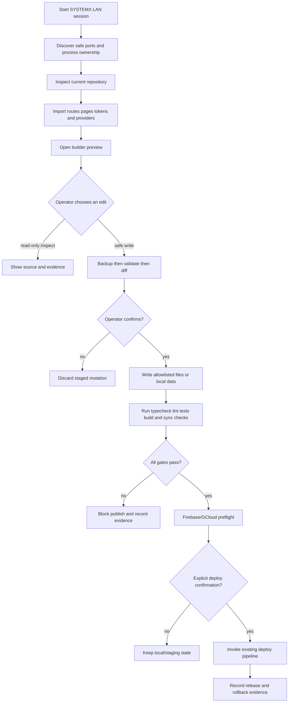

# SYSTEMX LAN Builder System Plan

Status: **Wave 0 complete; Wave 1 workspace and Wave 2 guarded local-edit vertical slice implemented**  
Target: **SFWA-WTL-G1 template editing mode**  
Primary local stack: **Node.js, React, Vite, Firebase Emulator Suite, Firebase CLI, and GCloud CLI**

## 1. Purpose

Re-imagine the useful parts of the public `WTL-Instatic` visual CMS as a
SYSTEMX internal builder for this repository. The builder is intended to let
an operator manage the template that is already open:

- inspect and edit existing pages;
- manage routes, layouts, modules, and reusable components;
- control design tokens and responsive CSS properties;
- manage CMS/CRM/data definitions;
- preview through the existing Vite development app and Firebase emulators;
- see whether local files, Firebase, and Google Cloud are in sync;
- preserve the existing CLI, security gates, backups, and deploy controls.

The first goal is **editing the current template**, not generating unrelated
websites. A future project generator may consume the same contracts, but it is
out of scope for the first builder release.

## 1.1 Current implementation checkpoint

The repository now has a functional local management vertical slice for this
plan:

- `.SYSTEMX/LAN/Builder/contracts/` contains the session, workspace, and
  provider capability contracts.
- `.SYSTEMX/LAN/Builder/importer/current-repo.mjs` discovers the current
  checkout's pages, routes, components, token sources, and kit files.
- `.SYSTEMX/LAN/Builder/runtime/port-utils.mjs` checks both IPv4 and IPv6
  loopback availability, records session ownership, and removes stale PID
  records without touching unrelated projects.
- `npm run dev:systemx` starts Vite and the LAN service with one owned session;
  `npm run systemx:session:status` and `npm run systemx:session:stop` report or
  stop only verified processes from that session.
- `/api/builder/workspace`, `/api/builder/data`, `/api/builder/source`, and the
  local page/record mutation routes expose sanitized current-template models.
- The dashboard manages page metadata, typed local node trees, CMS/CRM fixture
  records, local user fixtures, provider readiness, and allowlisted source
  files.
- Source writes require a per-session token, an allowlisted path, a backup, a
  secret-marker scan, and the exact `SAVE LOCAL CHANGE` confirmation. Every
  accepted write produces an ignored JSONL operation record.
- Cloud adapters are represented by capability/readiness cards only; no live
  Firebase, Google Cloud, Drive, or Stripe mutation is implied by the local
  builder.

This is intentionally a current-repository editor foundation, not a second
website generator and not a cloud control plane.

## 2. Reference findings from WTL-Instatic

`WTL-Instatic` is a public fork of Instatic. Its reusable architectural ideas
are:

| Pattern | SYSTEMX adaptation |
| --- | --- |
| Separate admin/editor surface | `.SYSTEMX/LAN` loopback service, never a product route |
| Canvas made from nested modules | Typed `NodeTree` for containers, text, images, buttons, lists, forms, and custom modules |
| Visual components with slots and parameters | Reusable SYSTEMX components with typed props and named slots |
| Shared templates/layouts | Site shell, page layouts, and content-type layouts with explicit outlets |
| Collections and loops | Provider-neutral collection descriptors bound to Firestore or SQL Connect sources |
| Design tokens and generated CSS | Token manifests with validation and controlled CSS generation |
| Preview and publish separation | Vite/emulator preview followed by existing `.SYSTEMX` preflight and deploy |
| One content model for pages and data | A common builder model with provider-specific persistence adapters |
| Media workspace and storage adapters | Cloud Storage for Firebase as the web-media default; Drive/GCS adapters for approved operator workflows |
| Permissioned plugins | Explicit provider/module capabilities, local-only by default, no arbitrary shell endpoint |
| Audit history and snapshots | SYSTEMX JSONL operation log plus immutable local backup/diff records |
| Clean published output | Keep the existing React/Vite output boundary; never ship builder code or credentials |

The reference project is not copied into this template. The builder remains
Node/Vite/Firebase-first and inherits this repository's cross-platform shell,
Firebase rules, account levels, and `.SYSTEMX` governance model.

Reference: [WTL-Instatic](https://github.com/WayneTechLab/WTL-Instatic).

### 2.1 Reverse-engineering map for the G1 template

The reference repository describes a single self-hosted admin/editor,
content engine, media workspace, access layer, audit log, and static
publisher. Its important implementation pattern is not “copy a CMS”; it is
one typed site model that feeds several controlled workspaces:

```text
Site model
├── design tokens and generated CSS
├── page tree, templates, outlets, and reusable components
├── collections, rows, forms, and loops
├── media and storage adapters
├── users, roles, sessions, and step-up controls
├── audit events, versions, drafts, and publish state
└── provider/plugin capabilities
```

SYSTEMX re-imagines that pattern for the current React/Vite/Firebase app:

| Reference capability | G1 implementation boundary |
| --- | --- |
| Visual canvas and live mode | `.SYSTEMX/LAN` node-tree model plus the existing Vite preview URL |
| Modules and nested containers | Typed local modules with container/text/image/button/form/collection-list types |
| Reusable components and slots | Existing `src/components` inventory first; typed slots and round-trip writer in Wave 6 |
| Templates, outlets, and 404 | Existing router/page inventory with future layout/outlet contracts |
| Collections, rows, forms, and CRM | Local fixture collections now; Firestore and SQL Connect adapters in later waves |
| Media manager | `.SYSTEMX/LAN/Files` fixture first; Firebase Storage, Drive, and GCS adapters by artifact class |
| Roles and account levels | Local Level 1–5 fixtures now; Firebase Auth/custom-claims workflow requires explicit auth |
| Draft/publish/version history | Local page status, backups, JSONL evidence now; deploy remains `.SYSTEMX` preflight |
| Plugins and AI tools | Capability registry and allowlisted actions; no arbitrary shell, network, or secret proxy |
| Static publisher | Existing Vite `dist/` boundary; LAN source is mechanically excluded from production output |

The reference project also demonstrates that data tables should be a common
model for forms, CRM-like records, collections, and loops rather than a
separate special case for every screen. G1 therefore keeps collection schemas
provider-neutral while assigning each one a capability-specific provider:
Firestore for document drafts, Firebase SQL Connect/Cloud SQL PostgreSQL for
relational CRM and transactions, Firebase Storage for public web media, Drive
for operator documents, GCS for internal archives, and Stripe only for
explicit test/payment workflows. This is an architectural translation, not a
claim that these providers are currently connected.

## 3.1 Co-management control plane

The builder is not complete if it can only edit page models. It must also be a
humanized operations screen for the codebase and its local tooling. The
control-plane contract is maintained in
[`CONTROL-PLANE-PLAN.md`](CONTROL-PLANE-PLAN.md).

### Control-plane responsibilities

- inspect repository, branch, commit, dirty paths, active ports, and owned
  processes;
- inspect versions and readiness for Node, npm, Vite, Firebase, GCloud,
  Stripe test tooling, Playwright, and SYSTEMX;
- run named TypeScript, lint, test, build, security, structure, sync, and
  provider-preflight actions;
- inspect and, after a separate implementation gate, edit allowlisted frontend
  and backend source such as Firebase Functions, rules, SQL Connect files, and
  provider configuration;
- show source backups, diffs, secret-scan results, operation logs, last
  preflight/deploy evidence, and rollback information;
- coordinate Agent 0 missions, waves, checkpoints, subagent summaries, and
  start/end-of-day handoffs;
- explain each result as `done`, `broken`, `blocked`, `needs-review`, or
  `skipped` in plain language.

### Action authority

The browser calls a typed action registry. It never submits a shell command,
executable path, arbitrary environment, service-account credential, or raw
provider request. Actions run through the Node control service with argument
arrays, `shell: false`, a fixed repository root, timeouts, cancellation, and
sanitized output.

| Lane | Current state | Next implementation gate |
| --- | --- | --- |
| Repository/page/component/provider inventory | implemented | Add structured evidence links |
| Allowlisted page/source local editing | implemented for current frontend paths | Extend with backend path classes and validators |
| Tool version/readiness cards | implemented | Add named executable action registry |
| TypeScript/lint/test/build/audit actions | CLI exists outside the LAN action registry | Add read-only runner and humanized result model |
| Firebase/GCloud/Stripe readiness | capability cards only | Add emulator and test-mode preflight actions |
| Mission/log/last deploy evidence | partial status and JSONL write evidence | Add run IDs, checkpoints, summaries, and deploy record |
| Live production deployment | intentionally not a LAN action | Keep `.SYSTEMX` deploy authority and typed confirmation |

### Backend editing rule

Backend editing is not enabled by adding a textarea. Before the LAN can write
`functions/`, Firebase rules, SQL Connect schema/operation files, or provider
configuration, each class needs:

1. a path and file-type allowlist;
2. a parser or validator appropriate to that file type;
3. backup, diff, restore, secret scan, and exact confirmation;
4. a post-write typecheck/lint/test/security gate;
5. an operation record that identifies the source, target, result, and next
   action without recording secrets.

Until those gates exist, the UI must show backend editing as planned or
read-only and must not imply that a provider or production function can be
mutated from the browser.

## 3. Non-negotiable boundaries

### Local-only control plane

The LAN service binds to `127.0.0.1` and serves only allowlisted builder assets
and JSON API routes. It does not serve `.SYSTEMX` as a general static folder.
It rejects unknown hosts/origins, uses a per-session token, and runs fixed
Node executable/argument arrays with `shell: false`.

### Current-repository edit mode

Every builder session has a target record:

```json
{
  "targetKind": "current-repo",
  "repositoryRoot": "/absolute/path/to/checkout",
  "branch": "main",
  "mode": "template-edit",
  "writePolicy": "backup-diff-confirm"
}
```

The builder refuses a write when the target is missing, the path is outside the
repository, the working tree has an unresolved conflict, or the write is not
represented by a known operation.

### No unrestricted cloud client

The browser never receives service-account keys, refresh tokens, private key
material, `.env` contents, or a generic command endpoint. Provider operations
go through the loopback service and the existing authenticated CLI/SDK
boundary. Production actions remain in the deploy command and require the
existing preflight and explicit operator confirmation.

### Preview is not deployment

Vite development and Firebase emulators are local preview surfaces. A green
preview does not authorize a production deploy. The builder must show the
active Firebase project, emulator mode, branch, working-tree state, and last
quality/security result before a deploy control is enabled.

## 4. Proposed local layout

```text
.SYSTEMX/LAN/
├── README.md
├── BUILDER-SYSTEM-PLAN.md
├── Builder/
│   ├── api/                 # typed request/response contracts
│   ├── adapters/            # current-repo, Vite, Firebase, GCloud adapters
│   ├── canvas/              # node tree, modules, slots, mutation rules
│   ├── contracts/           # JSON Schemas and provider capability manifests
│   ├── importer/            # read-only route/page/token discovery
│   ├── publisher/           # preview/export bridge; no direct production deploy
│   ├── server/              # loopback-only LAN server and action registry
│   ├── storage/             # provider-neutral artifact routing
│   └── ui/                  # local React/Vite builder application
├── Temp/                    # ignored sessions, locks, emulator state, previews
├── Backup/                  # ignored timestamped pre-write snapshots
└── Files/                   # ignored operator imports and exports
```

The listed Builder folders are an architecture target. Add each folder only
when its first tested implementation exists; do not create empty pretend
integrations for providers that are not configured.

## 5. Builder domain model

### Site workspace

The workspace is a read model of the current checkout and its connected local
services:

```text
Workspace
├── repository (path, branch, commit, dirty files)
├── routes (pathname, source, access, status)
├── pages (page tree, layout, metadata, draft/published state)
├── components (typed parameters, slots, dependencies)
├── tokens (color, type, spacing, breakpoints, CSS policy)
├── collections (schema, provider, query contract, access policy)
├── assets (media metadata, provider, usage, signed URL state)
├── integrations (Firebase/GCloud/Drive/SQL capability state)
└── evidence (imports, diffs, tests, backups, publish records)
```

### Node tree

Use one tree shape for pages, components, and layout slots:

```ts
type NodeTree<TNode> = {
  rootNodeId: string
  nodes: Record<string, TNode>
}
```

The first-party module set should be small and stack-appropriate:

- `container` with responsive layout and nesting;
- `text` with semantic element selection;
- `image` and `video` with approved media references;
- `link` and `button` with route/action validation;
- `list` bound to a collection query;
- `form` bound to a validated submission contract;
- `slot` and `component` for reusable site chrome;
- `outlet` for a page/content template boundary.

Every mutation must be typed, capability checked, backed up, logged, and
previewable. Recursive component references, invalid routes, unsafe CSS values,
and provider credentials in node props are rejected before a write.

### Design tokens and CSS

Tokens are the source of truth for builder-created styling. They include:

- color scales and contrast metadata;
- fluid type scale and font allowlist;
- spacing and layout scale;
- breakpoint names and constraints;
- radii, borders, shadows, motion preferences;
- custom CSS declarations limited by a sanitizer.

The builder may expose full CSS control for an operator, but “full control”
still means validated CSS values, a diff, a backup, and a production leakage
check. It does not mean injecting arbitrary HTML/script into the public build.

## 6. Storage and provider strategy

The builder uses a **capability-based provider registry**, not a single
untyped “storage” bucket. Each artifact class has a preferred provider and an
explicit fallback policy.

| Artifact | Local development | Primary cloud provider | Builder responsibility |
| --- | --- | --- | --- |
| Draft page trees, tokens, route metadata | Local repo + emulator fixtures | Firestore | Live document state, drafts, version metadata, rules |
| Realtime presence or ephemeral coordination | Local Realtime Database emulator or LAN memory | Firebase Realtime Database when needed | Presence only; never the audit source of truth |
| Relational CRM, orders, reporting, transactions | SQL Connect emulator/local PostgreSQL path | Firebase SQL Connect backed by Cloud SQL for PostgreSQL | Typed GraphQL schema, queries, mutations, migrations, least-privilege access |
| User media and web assets | Storage emulator or `.SYSTEMX/LAN/Files` fixture | Cloud Storage for Firebase | Upload policy, metadata, content type/size checks, signed URLs |
| Operator documents, setup packets, brand/production kit | Local `.SYSTEMX/KIT` and `Files` | Google Drive or Shared Drive | OAuth-scoped document sync; no public runtime dependency |
| Large internal object/archive data | Local fixture | Google Cloud Storage | Server/CLI-only adapter, lifecycle and retention policy |
| Analytics/search warehouse (future) | Fixture/export only | BigQuery or approved GCloud service | Read-oriented reporting; never the transactional source |

### Firebase SQL clarification

Firebase does support a SQL-backed product through **Firebase SQL Connect**.
SQL Connect connects Firebase applications to PostgreSQL in Cloud SQL, defines
schemas and operations through GraphQL, and provides a local emulator path.
Firestore and Realtime Database remain non-relational Firebase database
products; they are not SQL databases. The builder must label these services
accurately so an operator can choose the right data model.

Sources: [Firebase SQL Connect quickstart](https://firebase.google.com/docs/sql-connect/quickstart),
[SQL Connect configuration reference](https://firebase.google.com/docs/sql-connect/configuration-reference),
[Cloud SQL for PostgreSQL](https://cloud.google.com/sql/postgresql).

### Provider adapter contract

The future adapter interface is intentionally narrower than a generic database
driver:

```ts
type ProviderCapabilities = {
  artifactKinds: string[]
  read: boolean
  write: boolean
  list: boolean
  query: boolean
  transactions: boolean
  realtime: boolean
  signedUrls: boolean
  localEmulator: boolean
}

type BuilderProvider = {
  id: string
  capabilities: ProviderCapabilities
  health(): Promise<ProviderHealth>
  read(request: ReadRequest): Promise<ReadResult>
  write(request: WriteRequest): Promise<WriteResult>
  preview(request: PreviewRequest): Promise<PreviewResult>
}
```

Adapters must reject unsupported capabilities rather than silently falling
back to a different provider. The provider registry records the selected
adapter, project/account identity, environment (`local`, `staging`, or
`production`), and last successful health check.

Google Drive is treated as a document/file provider. The Drive API models files
and folders as resources and supports scoped create/list/update operations; it
is not a substitute for Firestore or SQL Connect. See [Drive files and folders](https://developers.google.com/workspace/drive/api/guides/about-files)
and [Drive create/manage files](https://developers.google.com/workspace/drive/api/guides/create-file).

Cloud Storage for Firebase is the web-media default because it is designed for
user-generated objects and supports Firebase Security Rules and Firebase/GCloud
access paths. See [Cloud Storage for Firebase](https://firebase.google.com/docs/storage).

## 7. Sync bridge

The bridge gives the operator one view of four different states:

```text
Local source files
       │
       ├── Vite build / preview
       ├── Firebase emulator fixtures
       ├── Firebase project metadata and rules
       ├── SQL Connect schema/query contract
       ├── Drive/GCloud artifact manifest
       └── CLI/MCP health and auth state
```

The bridge reports `in-sync`, `local-ahead`, `cloud-ahead`, `drifted`,
`unconfigured`, or `blocked`. It stores hashes and metadata, not secrets. A
future manifest should include:

```json
{
  "schemaVersion": 1,
  "workspace": "current-repo",
  "environment": "local",
  "providers": [],
  "artifacts": [],
  "lastCheckedAt": "UTC timestamp",
  "evidence": []
}
```

CSV may be offered as an export for staff review, but JSON is the canonical
machine-readable bridge format because nested provider capabilities, checks,
and evidence cannot be represented safely in a flat CSV without losing
meaning. Any CSV export must be derived, never hand-maintained as a second
source of truth.

## 8. Preview, edit, and publish lifecycle



The builder does not bypass `.SYSTEMX/scripts/deploy.sh`, security checks,
versioning, or the current public-build isolation guard.

## 9. Implementation waves

### Wave 0 — Contract and inventory — **complete**

- create the LAN directory contract;
- define workspace, provider, node-tree, and evidence schemas;
- import the current route/page/source inventory read-only;
- add architecture tests for public-build exclusion;
- document the local port/session lifecycle.

Exit gate: current app builds and the builder can display the current template
without writing files or requiring cloud credentials.

### Wave 1 — LAN shell and current-template workspace — **complete**

- loopback-only Node server;
- local session/port registry;
- builder dashboard with repository, route, page, token, and provider cards;
- Vite preview link and Firebase Emulator Suite health cards;
- source-template view with safe file allowlist;
- page, component, token, KIT, and provider inventory.

Implemented now: loopback LAN shell, cross-stack port registry, current page
and component importer, workspace/provider contracts, Vite bridge, source
inventory, source loader, and local tooling cards.

Exit gate: start/end-of-day can open and close only its own processes; product
URL remains the normal root route; LAN assets do not appear in `dist`.

### Wave 2 — Safe template editing — **implemented vertical slice**

- page metadata and route editor;
- node-tree canvas for the initial module set;
- responsive design-token editor;
- backup/diff/confirm/rollback workflow;
- generated source changes limited to explicit adapter-owned files;
- local CMS/CRM record and account-level fixture management;
- JSONL operation evidence and timestamped backups.

Exit gate for this slice: load and edit one existing template source file or
page model locally, preview it in Vite, preserve a backup/evidence record, and
prove no unrelated project process was touched. Full source-to-node round-trip
generation remains a later adapter-owned milestone.

### Wave 3 — Firebase local data plane — **next**

- Firestore emulator collections for drafts and builder metadata;
- Storage emulator for media fixtures;
- Realtime Database only for optional presence;
- local auth/account-level fixtures;
- rules tests and seed/export/import controls.

Exit gate: create/edit/preview a draft using emulators only; no live Firebase
project is contacted.

### Wave 4 — SQL Connect and provider registry

- add `dataconnect/` only when the project selects relational data;
- define one sample CRM/reporting schema and typed operations;
- add SQL Connect local emulator checks;
- expose provider capability and sync state in the LAN dashboard;
- keep browser access through generated/approved SDK operations.

Exit gate: a relational collection can be previewed and queried locally, and
the builder clearly distinguishes Firestore from SQL Connect.

### Wave 5 — Drive/GCloud document and asset adapters

- scoped Drive adapter for operator documents and kits;
- Cloud Storage/GCS adapter split by web-media vs internal archive use;
- checksummed manifest export/import;
- explicit account/project/environment display;
- staging-first sync and conflict review.

Exit gate: sync a non-secret test document/asset with a visible diff and
provider audit record; production credentials are never stored in the repo.

### Wave 6 — Publish and staff operations

- component/template reuse;
- collection loops and forms;
- audit timeline and version snapshots;
- staff roles and capability gates;
- Firebase hosting preview channel or local publish preview;
- deploy preflight integration and rollback evidence.

Exit gate: a WTL staff member can edit an existing template page from start to
finish, review evidence, pass gates, and choose whether to deploy.

## 10. Test strategy

### Unit and contract tests

- node-tree mutations preserve parent/child invariants;
- component slots reject recursion;
- CSS sanitizer rejects script URLs, expressions, and unsafe markup;
- provider capability checks reject unsupported operations;
- storage router maps artifact classes to the selected provider;
- sync bridge classifies hashes consistently;
- session manager claims/releases ports and verifies process ownership;
- backup/restore is atomic and path-confined;
- secrets never appear in manifests, logs, or API responses.

### Local integration tests

- Vite preview of the current template;
- Firebase Auth/Firestore/Storage emulator flow;
- SQL Connect emulator flow when configured;
- Drive/GCloud adapters in fixture or explicit test-project mode;
- builder edit → backup → diff → preview → restore;
- deploy preflight confirms it uses root `firebase.json` and `dist` only.

### Browser tests

Playwright should verify:

- LAN is reachable only on loopback;
- the builder can inspect the current app;
- the public app route remains a normal URL and does not expose LAN paths;
- menu start/end-of-day displays the active ports;
- one existing page can be edited and previewed;
- a rejected mutation leaves the working tree unchanged;
- the builder never displays secret values.

## 11. Risks and decisions

| Risk | Decision |
| --- | --- |
| Builder becomes a second product app | Keep it in `.SYSTEMX/LAN`, separate port, separate server, no public router import |
| Cloud vendors are treated as interchangeable | Use artifact classes and capability-aware adapters |
| Editing React source from a canvas becomes brittle | Start with an importer/read model and adapter-owned metadata; expand writes only after round-trip tests |
| SQL is confused with Firestore | Label SQL Connect/Cloud SQL separately and require an explicit relational selection |
| Drive becomes runtime content storage by accident | Restrict Drive to operator documents and approved file workflows |
| A menu action kills another project | Record process ownership and only stop session-owned PIDs |
| A local tool leaks into production | Build exclusion tests and keep LAN outside Vite/Firebase public inputs |
| AI or plugins gain arbitrary authority | Allowlisted actions, least-privilege provider grants, audit records, no generic shell/HTTP proxy |

## 12. Definition of done for G1 builder foundation

- the current template opens in a local SYSTEMX LAN dashboard;
- Vite and Firebase Emulator Suite status are visible;
- ports are discovered, recorded, and safely released;
- current routes/pages/tokens are inspectable;
- one existing page or allowlisted source file can be changed through a
  backed-up, confirmed operation;
- local page/node, CMS/CRM, and user fixture workspaces can be exercised from
  the dashboard;
- Firestore, Storage, SQL Connect, Drive, and GCloud are represented by
  explicit provider capability records;
- local emulator mode is the default test path;
- no LAN code is included in the public Vite/Firebase build;
- all writes and provider actions have sanitized evidence;
- the existing CLI remains the authority for quality and deployment.

## Reusable module contract

The builder treats a reusable module as a named, exportable design contract,
not as an arbitrary copy-and-paste fragment. A module can reference a React
source component or a local page/node model and declares:

- stable ID and human name;
- semantic role such as `header`, `footer`, `section`, `overlay`, or
  `component`;
- tags for global, shell, CMS, CRM, provider, or page use;
- named slots for content and child containers;
- responsive width behavior (`fluid`, `contained`, or `fixed`);
- local-draft/detected/review status;
- `systemx-component` export version.

The canonical schema is
`Builder/contracts/component-registry.schema.json`. Registry writes are
local-only, backed up, token-safe, and logged. They do not alter source until
an operator explicitly uses the source editor or a future adapter.

## Existing-project ingest contract

Existing projects enter through a read-only inventory lane. SYSTEMX detects
framework and package scripts, page and route candidates, component/layout
files, style files, provider/tooling indicators, and potential sensitive file
names without reading secret contents. It writes only an ignored manifest to
`.SYSTEMX/LAN/Temp/ingest/`.

No project is considered bridged until its manifest is reviewed, a backup is
created, an adapter plan is approved, and the target project’s own build,
router, deployment, and secret boundaries are preserved. The LAN never copies
itself into `public` or `dist`, and it never turns an inventory scan into a
cloud or production mutation.
