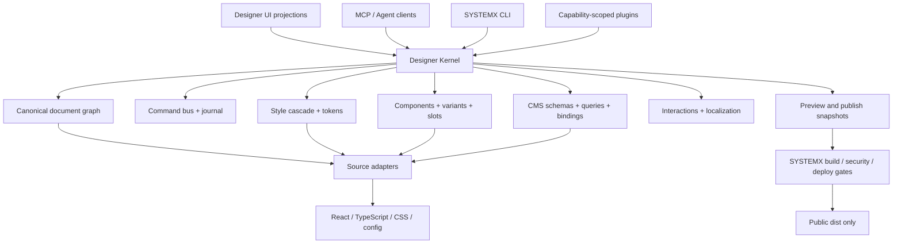

# 00 — Executive Summary

## Decision

Build the SYSTEMX LAN Designer as a **repository-native visual development control plane**, not as a cosmetic Webflow clone.

The current LAN already demonstrates a valuable differentiator: it treats local editing as an auditable software operation. Webflow's public documentation demonstrates the breadth a mature platform requires: Designer panels and modes, CSS-class authoring, breakpoints, variables and modes, components/slots/variants, CMS schemas and relationships, GSAP interactions, localization, comments, branching, activity history, staging, backups, publishing, site search, forms, Ecommerce, Analyze/Optimize, code components, Webflow Cloud, DevLink, Apps, CLI, and MCP. [WF-001, WF-005–WF-060, WF-061–WF-160]

The correct target is therefore:

> **Webflow-class authoring breadth + SYSTEMX-class repository control, evidence, portability, and operator authority.**

## Current LAN assessment

### What is already strong

- Local-only loopback topology and a development-only Vite bridge.
- Managed session IDs, auto-selected ports, PID ownership, and refusal to stop unrelated processes.
- Host/origin checks plus a per-session mutation token.
- Allowlisted source reads/writes, exact confirmation phrases, pre-write backups, secret-marker rejection, atomic writes, and JSONL operation evidence.
- A production build assertion that rejects LAN assets and `data-systemx-*` hints from `dist`.
- Useful interaction experiments: inspect/interact mode, canvas selection, Navigator projection, responsive presets, selected-text preview/revert, source mapping, component staging, local CMS/CRM fixtures, and project inventory ingest.

### What prevents it from being a full Designer

- The page/node data is not a canonical document model and lacks stable object identity across imports, source writes, canvas selection, history, and publication.
- Undo/redo buttons are UI placeholders; there is no command journal, transaction boundary, inverse operation, or deterministic replay.
- Source mutation relies on exact text matching rather than AST-aware edits.
- Route discovery is hard-coded for a small starter page set.
- The style system lacks selector graphs, declaration provenance, pseudo-states, breakpoint inheritance, variable modes, aliases, usage analysis, and safe refactoring.
- Components lack definitions vs. instances, typed props, variants, slots, dependency resolution, versioning, and migration rules.
- CMS fixtures lack field schema enforcement, references, queries, bindings, localization, workflow, indexes, and provider sync contracts.
- The user interface and server are large monolithic files, which makes testing, parallel work, and future plugins risky.
- Collaboration, comments, branches, merge review, publish snapshots, immutable artifacts, and role-scoped projections do not yet exist.

## Target platform layers

## Recommended order

### P0 — Stabilize truth and safety

1. Repair wiki commands, removed paths, version labels, setup-generation drift, and unsafe AI-secret wording.
2. Freeze the current LAN behaviors in integration tests.
3. Split the server and UI into testable modules without changing visible behavior.
4. Version every contract and add schema validation at all trust boundaries.

### P1 — Build the editor kernel

1. Introduce `DesignerDocument`, stable IDs, indexes, and migrations.
2. Introduce typed commands, transactions, inverse commands, journal persistence, undo/redo, replay, and evidence links.
3. Build read-only AST/CSS importers and provenance maps before enabling structural writes.
4. Make canvas, Navigator, panels, MCP, and CLI consume the same query/command interfaces.

### P2 — Structural and responsive authoring

1. Add insert/move/wrap/unwrap/duplicate/delete operations with parent-child constraints.
2. Build the style cascade, breakpoints, states, variables, modes, and responsive inheritance.
3. Add source generation and parse-print equivalence tests.

### P3 — Components, CMS, and bindings

1. Component definitions, instances, props, slots, variants, library links, versions, and migrations.
2. Collection schemas, fields, relations, items, queries, bindings, localization, and workflow.
3. Typed forms and provider adapters.

### P4+ — Publication, ecosystem, collaboration

Immutable snapshots, branch/review flows, comments, activity history, plugin SDK, MCP mutation tools, localization, Analyze overlays, experimentation, Ecommerce modules, and optional hosted/team modes.

## Product differentiation

LAN should not attempt to beat Webflow by copying every panel. It can be materially different and valuable by offering:

- source-controlled ownership instead of platform lock-in;
- current-repository editing instead of a closed project format;
- deterministic evidence for every change;
- local-first operation and emulator-first provider workflows;
- explicit human authorization for high-risk actions;
- cross-agent handoff through `.SYSTEMX` status, logs, manifests, and schemas;
- adapter support for React/Vite/Firebase first, with other stacks added through tested capability packs.

## Definition of success

The LAN can be called a production-ready visual development system when a page can be imported, structurally edited, styled across breakpoints, bound to typed data, converted into a reusable component, undone/redone, reviewed as a semantic diff, rebuilt deterministically, published as an immutable snapshot, and restored—without leaking LAN code, secrets, or ambiguous source mutations.
