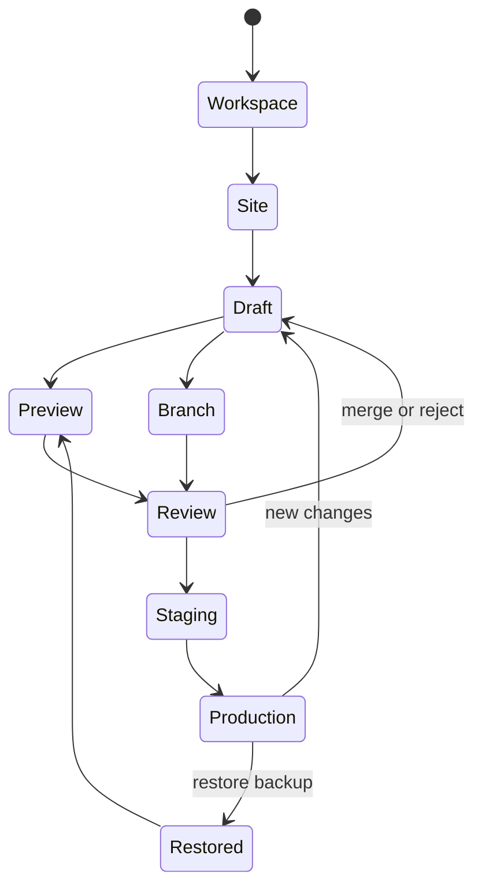

# 02 — Webflow Product and System Deconstruction

## 1. Webflow is no longer one visual site builder

The current documented product is a layered authoring and marketing platform. The visual Designer remains the center, but it is surrounded by workspace/site administration, CMS, localization, collaboration, publishing, analytics/optimization, commerce, AI, and a developer ecosystem. [WF-001–WF-004, WF-131–WF-160]

A useful decomposition is:

| Layer | Responsibility | SYSTEMX translation |
| --- | --- | --- |
| Account / Workspace | Identity, sites, members, seats, roles, billing, libraries, app authorization | Project registry, operator identity, capability grants, environment registry |
| Site control plane | Plans, domains, publishing targets, SEO, integrations, backups, activity | Site manifest, providers, environments, evidence, release policy |
| Designer | Pages, elements, styles, components, assets, interactions, canvas modes | Designer UI projections over a canonical document and command kernel |
| CMS / Commerce | Schemas, items, relationships, product/order specialization | Provider-neutral data contracts with optional commerce pack |
| Collaboration | Comments, reviewers, branches, permissions, activity | Object-anchored review, branch journal, merge policy, audit events |
| Runtime / Hosting | Built output, domains, staging, forms, search, tracking | Vite/Firebase build artifacts, environment manifests, adapters |
| Insights / Optimize | Canvas-linked analytics, clickmaps, experiments, results | Read-only overlays and experiment definitions keyed to stable node IDs |
| Developer platform | Designer/Data/Browser APIs, Apps, CLI, Code Components, DevLink, Cloud, MCP | Shared command/query registry, adapters, plugin SDK, CLI and agent clients |

## 2. Core lifecycle



The important lesson is that editing, previewing, reviewing, staging, publishing, and restoring are not aliases. Each has different data, permissions, and evidence.

## 3. The authoring data plane

A mature Designer must at minimum represent:

- sites and environments;
- static pages, folders, utility pages, dynamic templates, and locale variants;
- a stable element tree with semantic element types;
- styles/selectors, declaration blocks, pseudo-states, breakpoints, and inheritance;
- typed variables, aliases, modes, and usage references;
- component definitions, instances, props, slots, variants, and library ownership;
- assets and usage indexes;
- CMS schemas, items, references, queries, collection lists, and bindings;
- forms and submissions contracts;
- interaction triggers, targets, actions, timelines, and playback state;
- page/site metadata, search, SEO/AEO, schema, redirects, and publishing settings;
- comments, branches, backups, audit events, and release snapshots.

The interface is a collection of projections over this data plane. The Navigator is a tree projection. The canvas is a rendered projection. The Style panel is a declaration/cascade projection. The CMS panel is a schema/data projection. The Audit panel is a diagnostic projection. When those panels maintain separate ad-hoc state, drift is inevitable.

## 4. Command and event plane

Documented API breadth implies a typed operation surface. Webflow's Designer API exposes object-specific operations over elements, styles, variables, assets, pages, and components, while its Data API uses authenticated resource operations. [WF-061–WF-091, WF-158–WF-160]

For LAN, the minimum command architecture is:

```text
Intent -> authorization -> validation -> transaction -> mutation
       -> derived indexes -> source/snapshot adapters -> evidence -> UI update
```

Every command needs:

- command ID and schema version;
- actor/session/mission/wave;
- target object IDs and expected revision;
- typed payload;
- capability required;
- validation and policy result;
- deterministic changes and inverse or restore reference;
- evidence artifacts and follow-up gates.

## 5. Source of truth options

Webflow can use its own native project model. SYSTEMX is different: the current repository must remain authoritative. That creates three possible modes:

1. **Source-owned:** React/TS/CSS is truth; LAN imports and generates guarded AST patches.
2. **Document-owned:** `DesignerDocument` is truth; source is generated output.
3. **Hybrid controlled:** ownership is explicit per object/file; ambiguous round trips are blocked.

For the SFWA template, the recommended G1 path is **hybrid controlled**:

- existing hand-authored app source remains source-owned;
- new LAN-authored pages/components may begin document-owned;
- every object records ownership, adapter, source span, generated artifact, and sync revision;
- changing ownership requires an explicit migration command.

## 6. Control plane vs. runtime plane

Webflow distinguishes authoring APIs from published-site APIs. Its Browser API handles runtime lifecycle and tracking consent; the Designer API controls authoring objects; the Data API controls remote resources. [WF-087–WF-091]

LAN must preserve an even harder boundary:

- `.SYSTEMX/LAN` is local control-plane source;
- public `src/` and generated artifacts become the product runtime;
- Firebase/provider credentials never flow through the browser editor;
- runtime analytics/consent SDKs have no editor command authority;
- build output is scanned for control-plane leakage.

## 7. Commercial and entitlement model

Webflow separates Workspace capabilities, per-site plans, paid seats, add-ons, and enterprise features. [WF-135–WF-137]

The implementation lesson is not to copy product names or prices. Model:

```text
entitlement = capability + scope + quota + environment + expiry + source
```

Examples:

- `designer.structural.write` on site A;
- `publisher.production` on environment production;
- `cms.items.max = N`;
- `collaboration.page_branching` enabled;
- `ai.generate.copy` enabled for selected roles;
- `provider.stripe.test.write` but not live.

Authorization remains server-enforced and independent from billing state, even if billing grants an entitlement.

## 8. Strategic conclusion

The feature list is large, but the platform's leverage comes from a small number of deep primitives:

1. stable objects;
2. a typed command/event plane;
3. deterministic projection and rendering;
4. a real cascade and binding engine;
5. scoped authority;
6. immutable release evidence;
7. extension through shared contracts.

Build those primitives first. New panels then become relatively inexpensive projections instead of new islands of logic.
