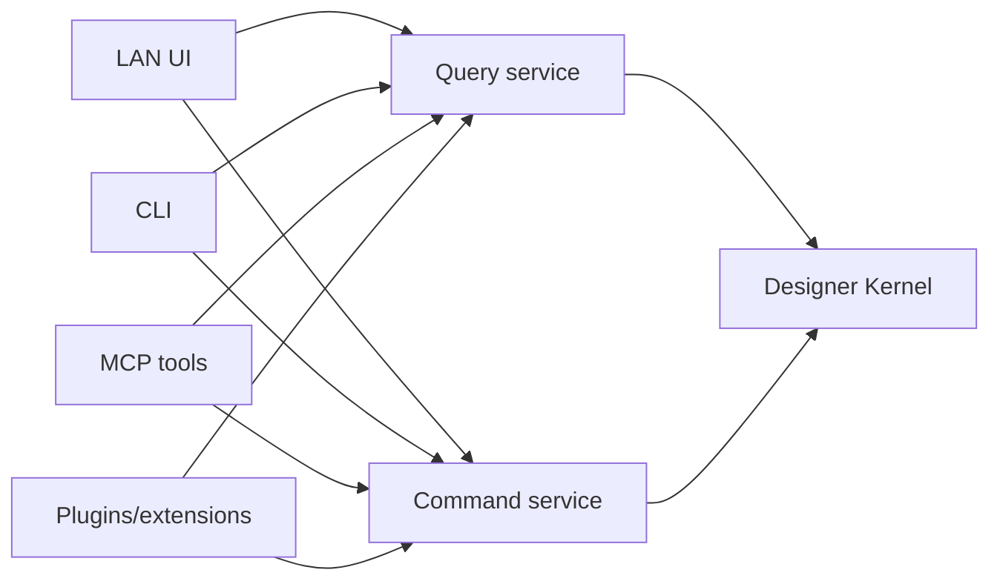

# 08 — Apps, APIs, Code Components, DevLink, CLI, MCP, and Extension Architecture

## 1. One platform, multiple clients

Webflow's current developer platform includes Designer API, Data API, Browser API, Code Components, Webflow Cloud, DevLink, Flowkit, Apps, CLI, and MCP. [WF-002–WF-004, WF-061–WF-130]

The architectural lesson is decisive: LAN's browser UI must not become the only implementation of editor logic.



## 2. Query vs. command APIs

Queries are read-only and cacheable:

- get workspace/document/page/node/style/component/schema;
- compute selection/cascade/source mapping;
- list usages/dependencies/findings;
- render preview status;
- read evidence and release manifests.

Commands mutate through validation and authorization:

- insert/move/update/delete;
- style/token/component/CMS changes;
- source generation;
- preview/publish requests;
- provider operations.

No endpoint accepts a shell command, executable path, arbitrary environment, raw secret, unrestricted SQL, or arbitrary filesystem target.

## 3. Plugin manifest

```ts
type DesignerPluginManifest = {
  id: string
  name: string
  version: string
  publisher: string
  entrypoints: {
    panel?: string
    commands?: string
    renderer?: string
  }
  capabilities: string[]
  objectTypes: string[]
  network: NetworkPolicy
  storage: StoragePolicy
  integrity: { algorithm: 'sha256'; digest: string }
  compatibility: { minKernel: string; maxKernel?: string }
}
```

Install and upgrade require review. A plugin receives only declared capabilities and a namespaced storage area. Network access is denied by default.

## 4. Extension UI

Extension panels run in isolated iframes or equivalent sandboxes and communicate through a message protocol. Requirements:

- origin pinning;
- protocol version negotiation;
- request IDs and timeouts;
- schema validation;
- capability check per call;
- size/rate limits;
- sanitized errors;
- no direct DOM access to the control plane;
- no credential access;
- explicit teardown on site/session change.

## 5. MCP tools

Begin read-only:

- `designer.get_workspace_summary`;
- `designer.get_selection`;
- `designer.get_page_tree`;
- `designer.get_style_trace`;
- `designer.get_findings`;
- `designer.get_source_mapping`;
- `designer.get_release_status`.

Mutation tools later return a proposed command/diff and require an approval token bound to command hash, actor, session, target, and expiry.

## 6. CLI

The CLI should expose the same contracts for deterministic automation:

```text
systemx designer inspect
systemx designer import --read-only
systemx designer validate
systemx designer diff --from <revision> --to <revision>
systemx designer preview --snapshot <id>
systemx designer export --adapter react-vite
systemx designer preflight --environment staging
```

CLI output supports human text and `--json`. Exit codes distinguish broken code, blocked policy, missing tool, target mismatch, needs-review, and cancellation.

## 7. Source/component interoperability

Adapters are registered by capability:

```ts
type SourceAdapter = {
  id: string
  frameworks: string[]
  canImport(path: string): Promise<ImportCapability>
  import(readContext: ReadContext): Promise<ImportResult>
  plan(commands: DesignerCommand[]): Promise<SourceChangePlan>
  apply(plan: SourceChangePlan, approval: Approval): Promise<ApplyResult>
  verify(result: ApplyResult): Promise<VerificationResult>
}
```

No adapter claims write support until parse, print, source-map, backup, diff, restore, and quality tests pass for its supported subset.

## 8. Data/provider apps

Remote adapters use narrow resources and methods. For each adapter record:

- environment and target identity;
- auth method/scopes;
- readable/writable artifact kinds;
- emulator/test support;
- idempotency/retry behavior;
- rate and quota handling;
- conflict semantics;
- audit/redaction policy;
- rollback or compensating action.

## 9. Versioning and compatibility

Every public contract needs:

- semantic version;
- deprecation notice period;
- migration path;
- capability negotiation;
- compatibility test fixtures;
- changelog;
- feature flags for incomplete surfaces.

This prevents the current monolithic dashboard from becoming an undocumented de facto API.
