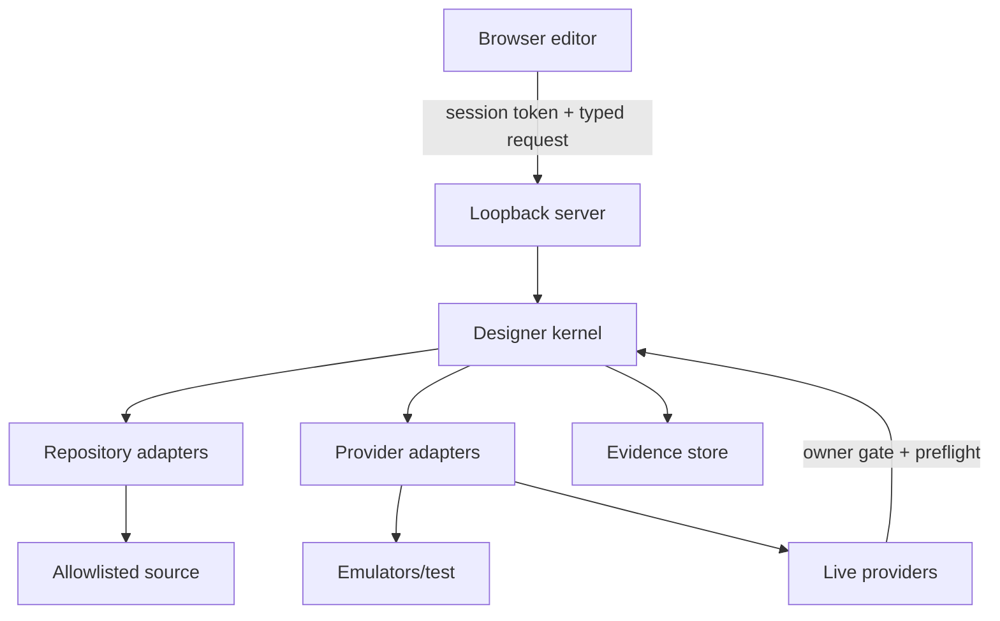

# 09 — Security, Governance, Commercial Boundaries, and Clean-Room Rules

## 1. Trust boundaries

The browser is not trusted with filesystem or cloud authority. Plugins and MCP clients are additional untrusted callers, even when local.

## 2. Preserve existing controls

Keep and test:

- loopback-only bind;
- IPv4/IPv6 port ownership checks;
- host and origin allowlists;
- high-entropy per-session mutation token;
- fixed methods and content limits;
- path canonicalization and allowlists;
- secret-shaped content detection;
- backup and atomic write;
- exact confirmation or cryptographic approval for risky commands;
- sanitized JSONL evidence;
- process ownership verification;
- `dist` leakage assertions.

## 3. Add missing controls

- schema validation for every request and persisted record;
- revision preconditions to prevent lost updates;
- command-level capabilities;
- CSRF-safe mutation protocol and same-site policy where applicable;
- plugin origin/integrity/capability sandbox;
- output encoding and HTML/CSS/URL sanitization;
- zip/path traversal prevention on imports;
- AST resource limits and cancellation;
- dependency/supply-chain policies for code components;
- provider target allowlists and live/test separation;
- audit-log integrity chaining or signed checkpoints;
- retention and rotation limits;
- secure temporary file permissions;
- rate limits and duplicate mutation prevention;
- threat-model review for every new adapter.

Use OWASP ASVS as the verification frame and OWASP guidance for CSRF and CSP. [STD-018–STD-020]

## 4. High-risk commands

Commands requiring owner-level approval include:

- installing/upgrading a plugin or code dependency;
- changing auth/security rules;
- enabling raw code embeds;
- modifying provider configuration;
- schema migration with destructive impact;
- reading/exporting sensitive data;
- live commerce/payment operation;
- production publish, domain change, or rollback;
- bypassing a failed gate;
- changing entitlement/role policy.

Approval is bound to the exact command plan and invalidated if revision, target, diff, or gate result changes.

## 5. Secrets

The wiki currently contains conflicting guidance, including a page that tells operators they will paste live keys and secrets into an AI session and then delete the chat. That is a P0 defect.

Correct policy:

- never paste live server secrets into AI chat;
- never expose secrets to the LAN browser, plugins, or MCP context;
- Firebase public client configuration is not a server secret, but target identity must still be verified;
- use Secret Manager/provider secret stores or OS keychain/approved local storage;
- use short-lived auth and least privilege;
- redact command output and evidence;
- rotate on suspected exposure.

## 6. Data classes

Every collection, form, asset, log, export, and analytics event should declare:

- classification: public, internal, confidential, restricted;
- purpose and lawful/contractual basis where applicable;
- allowed roles/providers/environments;
- retention and deletion;
- export/portability;
- localization/data residency;
- logging/redaction;
- backup/recovery;
- incident owner.

## 7. Entitlements vs. authorization

Commercial plans may grant capabilities or quotas, but server-side authorization must still verify actor, site, environment, object, and command. Never treat a paid flag, hidden button, or client-provided role as authority.

## 8. Clean-room product rules

- Do not copy Webflow source, private APIs, visual assets, icons, wording, or exact trade dress.
- Use generic names for concepts where possible.
- Document the independent architecture and sources.
- Follow open web standards for browser behavior.
- Recreate capabilities through original code and tests.
- Review trademarks and product naming before commercialization.
- Maintain third-party notices for libraries actually used.

## 9. Security release gates

A release cannot pass unless:

- all mutation endpoints are typed and capability checked;
- no generic shell/filesystem/provider proxy exists;
- plugin and code-component policy passes;
- secrets and private paths are absent from artifacts/logs;
- dependency and license checks pass;
- LAN markers are absent from public output;
- authorization tests cover all roles and environments;
- rollback evidence exists;
- high-risk accepted findings have owner and expiry.
