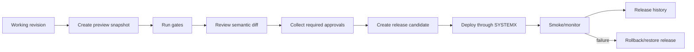

# 18 — Publishing, Versioning, Review, Branching, and Collaboration Plan

## Revision layers

Do not use one version number for everything.

| Revision | Changes when |
| --- | --- |
| Document revision | a domain transaction commits |
| Source revision | repository source changes/commit hash changes |
| Adapter version | importer/generator implementation changes |
| Preview snapshot | document/source/toolchain combination is frozen |
| Release version | an approved snapshot is published |
| Schema migration version | data model changes |
| Component version | public component contract changes |

## Preview snapshot

A preview snapshot freezes:

- document revision;
- source commit/tree hashes;
- adapter/toolchain versions;
- environment configuration names;
- generated routes/assets/search/schema;
- fixture/emulator data reference;
- build artifacts and hashes;
- diagnostics and test results.

The canvas can render a mutable live preview during editing, but release review uses a snapshot.

## Semantic review

Review views include:

- pages/routes changed;
- nodes added/moved/deleted;
- effective style changes by breakpoint/state;
- tokens/variables changed and usages;
- component API/variant changes and impacted instances;
- CMS schema/item/binding changes;
- interactions/locales changed;
- generated source diffs;
- diagnostics before/after;
- target/environment and gates.

## Branch model

### G1 — page branch journal

```ts
type PageBranch = {
  id: string
  pageId: string
  baseDocumentRevision: number
  journal: DesignerCommand[]
  status: 'draft' | 'in-review' | 'approved' | 'merged' | 'rejected'
  authorId: string
  reviewers: string[]
}
```

Merge:

1. replay branch against base;
2. compare current main revision;
3. detect object-level conflicts;
4. generate semantic merge plan;
5. resolve conflicts;
6. validate/build preview;
7. commit one merge transaction.

### Later — multi-page/full-document branches

Only after page branches and object conflict semantics are proven.

## Comments and approvals

Comments anchor to stable objects, selection ranges, style properties, CMS fields, source spans, or release findings. Approval records specify scope:

- content approved;
- design approved;
- accessibility approved;
- security approved;
- production publish approved.

An approval becomes stale when its scoped objects change.

## Presence

Presence is a separate ephemeral service. Show actor cursor/selection/page/mode and soft locks. Do not infer authority from presence. Durable changes still use commands and revision checks.

## Publish workflow



## Rollback

Rollback points to a prior release manifest and re-runs target verification. It creates a new release event and preserves the failed release. Data/schema rollback may require forward fixes rather than destructive reversal; this must be declared in migration plans.

## Activity history

Events can be filtered by:

- actor/session/mission/wave;
- object/page/component/collection;
- command type;
- source path;
- provider/environment;
- release;
- status/risk.

Evidence is linked, not duplicated into giant log records.

## Notifications

Events drive optional notifications for:

- comment mentions;
- review requests;
- branch conflicts;
- failed gates;
- stale approvals;
- provider sync failures;
- production release/rollback;
- expiring accepted risks.

Notification adapters never become the source of truth; journal/activity records do.
