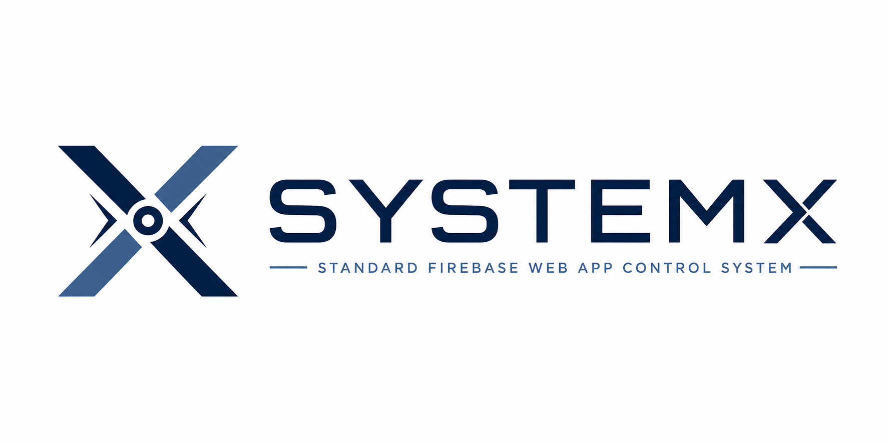
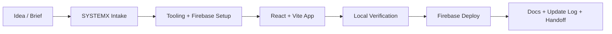
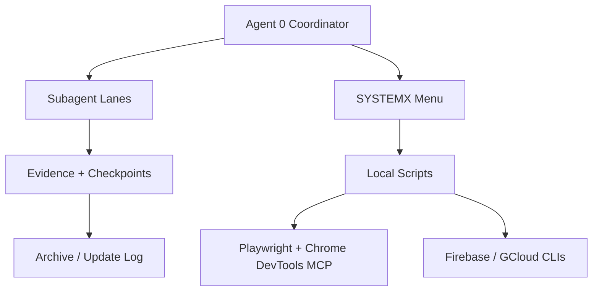

# SFWA-WTL TEMPLATE

<p align="center">
  <a href="https://WayneTechLab.com">
    
  </a>
</p>

<p align="center">
  
</p>

> **SFWA-WTL TEMPLATE** is the public Wayne Tech Lab LLC standard for building a
> Firebase web app from idea to production with a reusable React, TypeScript,
> Vite, Firebase, Playwright, MCP, and SYSTEMX operating layer.


[WayneTechLab.com](https://WayneTechLab.com) |
[Use This Template](https://github.com/WayneTechLab/SFWA-WTL-TEMPLATE/generate) |
[Read The Wiki](https://github.com/WayneTechLab/SFWA-WTL-TEMPLATE/wiki) |
[Agent Mesh Standard](https://github.com/WayneTechLab/SFWA-WTL-TEMPLATE/wiki/Agent-Mesh-and-Tooling-Standard) |
[Update Log](https://github.com/WayneTechLab/SFWA-WTL-TEMPLATE/wiki/Update-Log)

## What This Gives You

SFWA-WTL TEMPLATE is a public, use-at-own-risk base for teams that want the same
starting system every time: local setup, Firebase wiring, quality checks,
deployment guidance, AI-agent collaboration standards, and browser automation
patterns in one repo.

The goal is not to hide complexity. The goal is to put it in the right places:
root app code stays clean, `.SYSTEMX` owns operations, the wiki owns deep docs,
and the update log owns release history.

## Who Benefits

| Beneficiary | Benefit |
| --- | --- |
| Solo builders | Start with a working Firebase-ready web app instead of an empty folder. |
| Small teams | Share one setup process, one menu system, and one documentation standard. |
| Agencies | Fork a repeatable client-project base with clear handoff docs. |
| AI-assisted developers | Give Agent 0 and subagents a bounded operating standard instead of ad hoc prompts. |
| Security reviewers | Find rules, env guidance, local verification, and warning language in predictable places. |
| Operators | Use local scripts and menu flows before deploy, with fewer hidden moving parts. |

## System Flow



## Control Plane



## Wayne Tech Lab LLC Notice

SFWA-WTL TEMPLATE is provided by **Wayne Tech Lab LLC** as a public starter
template. It is intended as a reusable foundation for Firebase web app projects,
not as a finished production system for every use case.

Use this template at your own risk. You are responsible for reviewing,
configuring, securing, testing, and complying with all laws, platform terms, and
third-party service requirements before using it in production. Wayne Tech Lab
LLC provides this template "as is", without warranties or guarantees of fitness
for a particular purpose.

This project is released under the [MIT License](LICENSE).

This template is Firebase-first and locally verifiable, with direct deploys
from the developer workstation. Runner-based automation is intentionally kept
out of the base template.

This repository is **three things at once**:

1. **A runnable starter app** — the files at the repo root (`src/`, `package.json`,
   `vite.config.ts`, `firebase.json`, …) are a production-ready React + Firebase
   app that boots out of the box. Click **“Use this template”** to start a new
   project from it.
2. **A full setup playbook** — [`.SYSTEMX/Template/`](.SYSTEMX/Template/) contains
   an ordered, gated, AI-agent-friendly system (`steps/00` → `steps/12`) that
   takes you from a bare machine to a deployed, monitored, billing-enabled
   product.
3. **A generic AI/tooling standard** — [`.SYSTEMX/AI/`](.SYSTEMX/AI/) defines
   Agent 0, subagent lanes, message envelopes, Playwright, Chrome DevTools MCP,
   desktop automation boundaries, external connector adapters, and recovery
   playbooks without exposing private project-specific vendor logic.

Full documentation lives in the
[Project Wiki](https://github.com/WayneTechLab/SFWA-WTL-TEMPLATE/wiki).
Release history lives in the
[Update Log](https://github.com/WayneTechLab/SFWA-WTL-TEMPLATE/wiki/Update-Log).

---

## Use this template

```bash
# Start a new private repo straight from the live template:
gh repo create my-app --template WayneTechLab/SFWA-WTL-TEMPLATE --private --clone
cd my-app
```

…or click the green **“Use this template”** button on GitHub.

## Quick start

```bash
# 1. Install + run — the app boots even before Firebase is configured:
npm install
npm run dev               # → http://localhost:5173

# 2. Add your Firebase web config, then build:
cp .env.example .env.local   # fill VITE_FIREBASE_* from the Firebase console
npm run build

# 3. (optional) Deploy to Firebase Hosting:
bash .SYSTEMX/scripts/deploy.sh hosting --dry-run
bash .SYSTEMX/scripts/deploy.sh hosting --project your-firebase-project-id
```

## One-command tooling setup

Get every SDK + CLI installed, authenticated, and verified in one pass — Node,
Git, GitHub CLI (`gh`), Google Cloud SDK (`gcloud`), Firebase CLI, and optionally
payment, browser/MCP, workspace, DNS, and external connector support:

```bash
bash .SYSTEMX/WSG-MENU.sh                          # → 1) 🚀 Start Template into Production
# …or directly:
bash .SYSTEMX/scripts/bootstrap.sh --with-stripe --with-mcp --interactive-login
bash .SYSTEMX/scripts/bootstrap.sh --with-stripe --with-mcp --with-m365 --with-godaddy --interactive-login
bash .SYSTEMX/scripts/bootstrap.sh --check         # verify only (no changes)
npm run browser:install                            # install Playwright Chromium
npm run browser:codegen                            # record local browser flows
npm run ai:standard:check                          # verify SYSTEMX AI standards
```

[`WSG-MENU.sh`](.SYSTEMX/WSG-MENU.sh) is the control panel for the whole
lifecycle (tooling, Firebase config capture, guided setup, quality, version,
deploy). See the [operational system](.SYSTEMX/README.md).

### 🚀 Start Template into Production (menu option #1)

The fastest path from a fresh clone to a live app — a single guided, **one-time,
secure** wizard:

```bash
bash .SYSTEMX/WSG-MENU.sh        # → 1) 🚀 Start Template into Production
```

It walks you through, in order:

1. **Tooling** — verify (and optionally install/auth) every SDK + CLI
2. **Identity** — project name / slug
3. **First-time setup intake** — fill the ordered `.md` files in
   `.SYSTEMX/Unified-Setup-Process/intake/`, then re-inject
   `06-AI-REINJECTION-PROMPT.md` into the AI/code tooling session
4. **Firebase / Google config** — paste your `firebaseConfig`, a raw `.env`
   block, or point at `GoogleService-Info.plist` / `google-services.json`
   (processed **once**)
5. **Seed env files** — writes `.env.local` (client) + `.secrets.env` (server,
   `chmod 600`) securely
6. **Prompt Ingest** — point at your project build-spec `.md`; it's copied to
   `PROMPT-INGEST.md` for your AI agent to build on top of the template
7. **Verify** — `npm install` + production build
8. **Deploy** — Firebase login/project select + deploy (optional)
9. **Security wrap-up** — reminds you to **delete the AI chat** since live keys
   were handled

### Type `WSG-MENU` anywhere

Install a shell command so you can open the control panel from any terminal:

```bash
bash .SYSTEMX/scripts/install-command.sh   # adds WSG-MENU to your ~/.zshrc / ~/.bashrc
# then, in a new terminal:
WSG-MENU
```

## What's inside

- **React 19** + **TypeScript** (strict) + **Vite 8**
- **Tailwind CSS 4** with light/dark support
- Lightweight local client router with a shared layout (Navbar + Footer)
- **Firebase** client config (Auth, Firestore, Storage) — boots even before
  you add credentials
- Deploy-ready **Firebase Hosting** config with security headers + rules
- **ESLint** flat config + local verification scripts (lint · typecheck · build)
- Base pages: **Home**, **About**, **Services**, **Docs**, **Login**, **Contact**, **404**
- A complete **setup playbook** under `.SYSTEMX/Template/` for the full path
  (provisioning, payments, Cloud Functions, env/secrets, testing, monitoring)
- A generic **SYSTEMX AI standard** for Agent 0, subagents, MCP, Playwright,
  external connectors, and recovery flows

## The stack at a glance

| Layer | Default choice |
| --- | --- |
| Language | TypeScript (strict) |
| UI runtime | React 19 |
| Build / dev server | Vite 8 |
| Styling | Tailwind CSS 4 |
| Auth / DB / Storage | Firebase (Auth, Firestore, Storage) |
| Serverless backend | Firebase Cloud Functions (Node 22) — *playbook* |
| Payments | Optional payment provider — *playbook* |
| Hosting | Firebase Hosting |
| Errors / tracing | Sentry (optional) — *playbook* |
| Lint | ESLint 9 (flat config) |
| Release gates | Local verification + Firebase deploy |

> Full version pins and rationale live in
> [`.SYSTEMX/Template/WEBAPP-STACK-G1.0.md`](.SYSTEMX/Template/WEBAPP-STACK-G1.0.md)
> and the [wiki](https://github.com/WayneTechLab/SFWA-WTL-TEMPLATE/wiki/Architecture-and-Stack).

## Scripts

| Script | Description |
| --- | --- |
| `npm run dev` | Start the Vite dev server |
| `npm run build` | Production build to `dist/` |
| `npm run preview` | Preview the production build |
| `npm run typecheck` | TypeScript checks |
| `npm run lint` | ESLint |
| `npm run lint:fix` | ESLint with autofix |

## Project structure

```
.
├── index.html                # Vite entry HTML
├── package.json              # scripts + dependencies
├── vite.config.ts            # Vite + React + Tailwind + @ alias
├── tsconfig.json             # strict TypeScript config
├── eslint.config.js          # ESLint flat config
├── firebase.json             # Hosting + rules + security headers
├── firestore.rules           # Firestore security rules
├── storage.rules             # Storage security rules
├── .env.example              # VITE_FIREBASE_* client config template
├── docs/assets/              # Wayne Tech Lab + SYSTEMX public landing assets
├── src/
│   ├── main.tsx              # entry + local router
│   ├── router.tsx            # routes
│   ├── index.css             # Tailwind entry
│   ├── config/firebase.ts    # Firebase client init (lazy/guarded)
│   ├── components/layout/     # Layout, Navbar, Footer
│   └── pages/                # Home, About, Services, Docs, Login, Contact, 404
└── .SYSTEMX/                  # operational system + setup playbook
    ├── WSG-MENU.sh           # ⭐ control panel (tooling, setup, deploy)
    ├── scripts/              # bootstrap · deploy · quality · version · firebase
    ├── hooks/                # git hooks (version tracking, dep reminders)
    ├── version/              # app-version.txt · version.json · CHANGELOG.md
    ├── status/               # TODO · IN_PROGRESS · DONE
    └── Template/             # the full setup playbook (steps 00 → 12)
        ├── WEBAPP-STACK-G1.0.md  # master playbook
        ├── setup.sh              # interactive orchestrator
        └── steps/                # ordered, gated setup guides
```

## The full setup playbook

The runnable app at the root is **Step 02 (scaffold)** of a larger, ordered
system. When you need the complete path — Firebase provisioning, payments, Cloud
Functions, security rules, env/secrets, testing, and monitoring — follow the
playbook:

```bash
cd .SYSTEMX/Template
bash setup.sh               # interactive — walks every step with verification gates
# ...or use Unified-Setup-Process first, then work WEBAPP-STACK-G1.0.md steps as needed.
```

| Mode | When to use | Entry point |
| --- | --- | --- |
| ⚡ Fast start | You want a running app now | This repo root → `npm install` → `npm run dev` |
| Guided (agent) | You're driving an AI coding agent | Feed it `.SYSTEMX/Template/WEBAPP-STACK-G1.0.md`, then the `steps/` files |
| Guided (human) | Building by hand | Read the master playbook, work `steps/00` → `steps/12` |
| Scripted | Interactive bootstrap | `bash .SYSTEMX/Template/setup.sh` |

## Documentation

The [**Project Wiki**](https://github.com/WayneTechLab/SFWA-WTL-TEMPLATE/wiki) is the
deep-dive home for:

- [Quick Start](https://github.com/WayneTechLab/SFWA-WTL-TEMPLATE/wiki/Quick-Start)
- [Architecture & Stack](https://github.com/WayneTechLab/SFWA-WTL-TEMPLATE/wiki/Architecture-and-Stack)
- [Project Structure](https://github.com/WayneTechLab/SFWA-WTL-TEMPLATE/wiki/Project-Structure)
- [Environment Variables](https://github.com/WayneTechLab/SFWA-WTL-TEMPLATE/wiki/Environment-Variables)
- [Security Baseline](https://github.com/WayneTechLab/SFWA-WTL-TEMPLATE/wiki/Security)
- [Setup Playbook (Steps 00–12)](https://github.com/WayneTechLab/SFWA-WTL-TEMPLATE/wiki/Setup-Playbook)
- [Deployment](https://github.com/WayneTechLab/SFWA-WTL-TEMPLATE/wiki/Deployment)
- [Testing & QA](https://github.com/WayneTechLab/SFWA-WTL-TEMPLATE/wiki/Testing-and-QA)
- [Agent Mesh & Tooling Standard](https://github.com/WayneTechLab/SFWA-WTL-TEMPLATE/wiki/Agent-Mesh-and-Tooling-Standard)
- [Update Log](https://github.com/WayneTechLab/SFWA-WTL-TEMPLATE/wiki/Update-Log)
- [FAQ](https://github.com/WayneTechLab/SFWA-WTL-TEMPLATE/wiki/FAQ)

## Versioning

Current public template version: **2.1.0**.

README is the landing page. Release history belongs in the
[wiki update log](https://github.com/WayneTechLab/SFWA-WTL-TEMPLATE/wiki/Update-Log)
and `.SYSTEMX/version/CHANGELOG.md`.

---

Provided by Wayne Tech Lab LLC to help teams ship faster. Review it, adapt it,
secure it, and make it yours.
