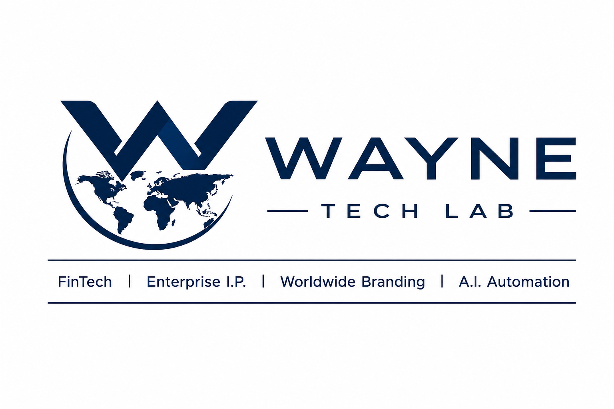
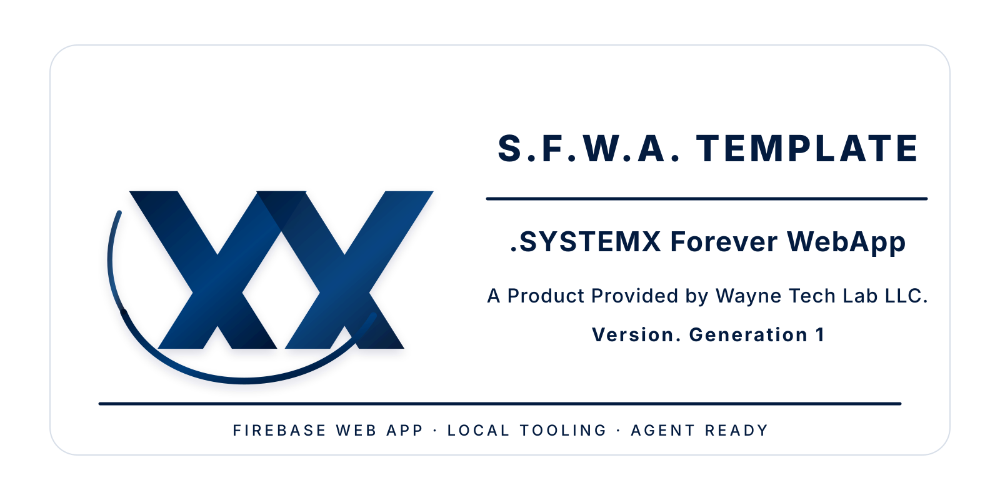

# S.F.W.A. Template — Generation 1

<p align="center">
  <a href="https://WayneTechLab.com"></a>
</p>

<p align="center">
  
</p>

> **S.F.W.A. Template — “.SYSTEMX Forever WebApp”** is a public Firebase web-app
> foundation provided by **Wayne Tech Lab LLC**. It takes a project from an idea
> to an operator-verified Firebase release using React, TypeScript, Vite,
> Firebase, Playwright, MCP/browser tooling, and the `.SYSTEMX` control layer.

[Use this template](https://github.com/WayneTechLab/SFWA-WTL-TEMPLATE/generate) ·
[Wiki](https://github.com/WayneTechLab/SFWA-WTL-TEMPLATE/wiki) ·
[0 → Production guide](https://github.com/WayneTechLab/SFWA-WTL-TEMPLATE/wiki/SYSTEMX-0-to-Production-Guide) ·
[CLI reference](https://github.com/WayneTechLab/SFWA-WTL-TEMPLATE/wiki/SYSTEMX-CLI-and-Tooling-Reference) ·
[Update log](https://github.com/WayneTechLab/SFWA-WTL-TEMPLATE/wiki/Update-Log) ·
[WayneTechLab.com](https://WayneTechLab.com)

## Start here

```bash
gh repo create my-app --template WayneTechLab/SFWA-WTL-TEMPLATE --private --clone
cd my-app
npm install
npm run wtl:doctor -- --strict=false
npm run wtl:local -- start-day
npm run wtl:local -- status
```

`start-day` starts an **owned loopback-only session** for this repository. It
selects free ports instead of taking another local project’s port, records only
its own processes in ignored local state, and reports the resulting URLs. Stop
only that session when finished:

```bash
npm run wtl:local -- end-day
```

For an interactive lifecycle menu on macOS, Windows, or supported Linux/WSL:

```bash
npm run wtl:menu
```

## The operating model

```mermaid
flowchart LR
  I["0 · Idea and constraints"] --> R["1 · Readiness and repository learning"]
  R --> P["2 · Intake, plan, and architecture"]
  P --> C["3 · Configure Firebase and local secrets"]
  C --> B["4 · Build with bounded agent lanes"]
  B --> V["5 · Verify locally and in emulators"]
  V --> D["6 · Deploy with preflight"]
  D --> H["7 · Handoff, archive, and operate"]
```



The root is the app: `src/`, Firebase configuration, package manifest, and
public docs. `.SYSTEMX/` is the operational layer: setup, command menu, local
session control, agent coordination, platform support, logging, kits, and deep
documentation. Do not import `.SYSTEMX` into the public app build.

## Stable commands

| Need | Command |
| --- | --- |
| Interactive operator menu | `npm run wtl:menu` |
| OS, architecture, SDK and CLI check | `npm run wtl:doctor -- --strict=false` |
| Guided workstation/project setup | `npm run wtl:setup -- --check` |
| Start / inspect / stop local session | `npm run wtl:local -- start-day`, `status`, `end-day` |
| Start Firebase emulators with safe dynamic ports | `npm run wtl:local -- start-day --firebase` |
| Run the whole local release gate | `npm run ci:all` |
| SYSTEMX structure, links, adapters, audit | `npm run wtl:audit` |
| Deploy preflight or Firebase dry run | `npm run wtl:deploy -- --preflight` / `--target hosting --dry-run` |
| Agent bus checkpoint / summary / archive | `npm run wtl:bus -- post|summary|archive …` |
| Generate opt-in MCP configuration | `npm run wtl:mcp` |
| Install Chromium / record a browser flow | `npm run browser:install` / `npm run browser:codegen` |

The `wtl:*` commands are the supported cross-platform contract. Existing `.sh`,
`.ps1`, and `.cmd` files remain compatibility launchers; do not build new
project workflows around shell-specific behavior.

## Agent, LLM, CLI, SDK, MCP, and browser routing

Agent 0 coordinates a bounded mission. Subagents own non-overlapping lanes,
report evidence, and never inherit deploy or secret authority. Use the cheapest
reliable capability first:

1. `.SYSTEMX` documentation, status, and deterministic scripts.
2. Targeted local file search and the SYSTEMX CLI.
3. A known provider CLI or SDK operation.
4. Playwright for repeatable local browser checks.
5. Chrome DevTools MCP for live local/staging inspection.
6. Desktop automation only when the above cannot reach the required surface.
7. Human approval for secrets, spending, production state, permissions, or an
   ambiguous account.

Start a mission with the prompt in
[`.SYSTEMX/AI/LLM-INTERFACE-AND-TOOL-ROUTING.md`](.SYSTEMX/AI/LLM-INTERFACE-AND-TOOL-ROUTING.md).
It gives Agent 0 a compact read order, lane contract, bus commands, and
end-of-task handoff format.

## Local SYSTEMX dashboard

`npm run dev:systemx` starts two separate loopback services:

- the public Vite app, on a selected free port beginning at `5173`;
- the local-only SYSTEMX LAN dashboard, on a selected free port beginning at
  `7331`.

The dashboard source is committed under `.SYSTEMX/LAN/`; its runtime, imports,
backups, and temporary files stay local. It is not a Vite route, not a Firebase
Hosting route, and is checked out of `dist` before release.

## Support and safety

- Primary: macOS Apple Silicon, Windows 11 x64, and Windows 11 ARM64.
- Compatibility: macOS Intel; Ubuntu, Debian, and WSL2 on x64/ARM64.
- Node 24 is the SYSTEMX target. Run `npm run wtl:doctor` to verify a machine.
- Playwright is a pinned project tool. Firebase CLI is invoked through an exact
  pinned SYSTEMX version; run `npm install` before browser commands.
- Google Cloud and some optional provider CLIs may require x64 emulation on
  Windows ARM64. SYSTEMX reports that clearly and does not hide the choice.

## What is included

- React 19, TypeScript, Vite, Tailwind, Firebase Auth/Firestore/Storage, and
  Firebase Hosting configuration.
- Cross-platform SYSTEMX CLI with interactive menu, diagnostics, setup packets,
  deployment preflight, logging, version sync, and local session ownership.
- Agent 0, subagent, MCP, Playwright, browser recovery, and external connector
  standards under `.SYSTEMX/AI/`.
- Local-only SYSTEMX LAN dashboard isolated from the customer-facing build.
- Production and brand guide kits that can be addressed directly by an LLM or
  tools through their repository path.

## Notices

Fork, clone, and adapt this template at your own risk. It changes frequently.
You are responsible for the code, security review, credentials, accessibility,
privacy, provider terms, legal compliance, testing, monitoring, and production
support for every project you create. Subagents multiply token and tool usage;
give them finite scopes and verify their output. Wayne Tech Lab LLC provides
this public template as-is under the [MIT License](LICENSE). If it materially
helps your project, please credit Wayne Tech Lab LLC and link back to this
template.

Deep operator guidance lives in the [Wiki](https://github.com/WayneTechLab/SFWA-WTL-TEMPLATE/wiki); release history lives in the [Update Log](https://github.com/WayneTechLab/SFWA-WTL-TEMPLATE/wiki/Update-Log) and [`.SYSTEMX/version/CHANGELOG.md`](.SYSTEMX/version/CHANGELOG.md).
