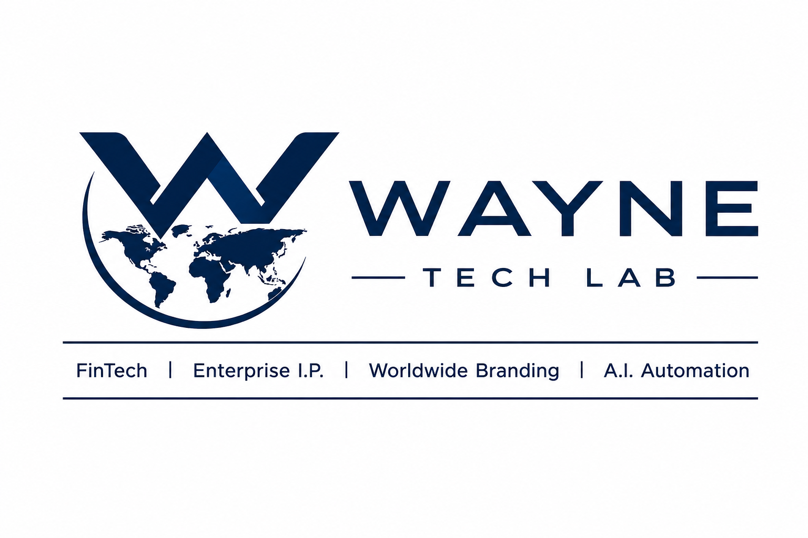
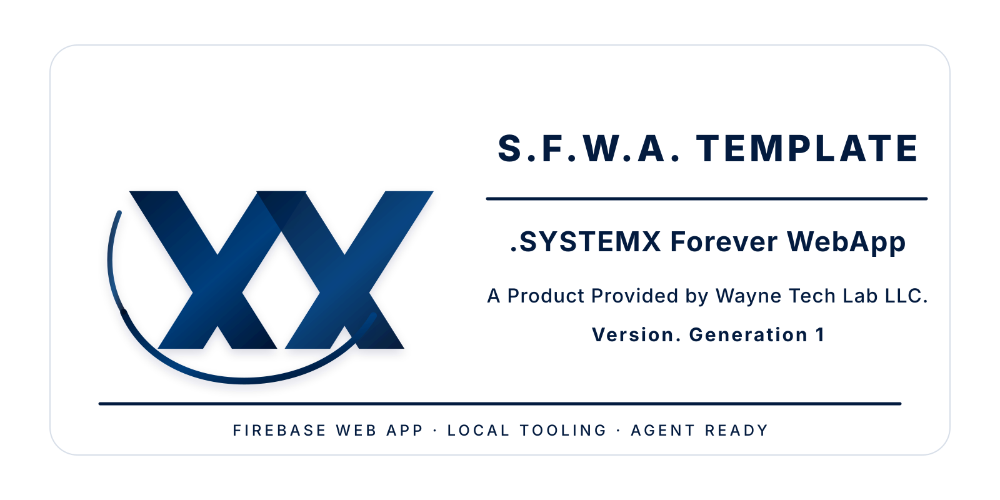
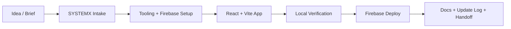
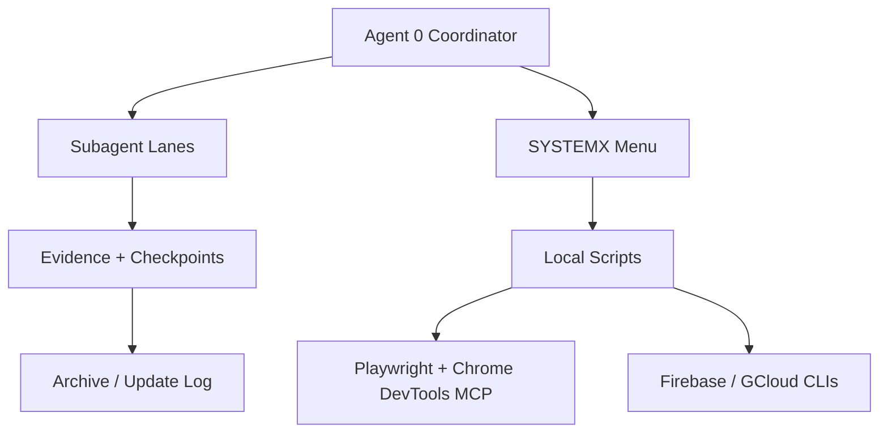

# SFWA-WTL-TEMPLATE — SYSTEMX Forever WebApp

**Unified public template 3.1.0 · managed dotSYSTEMX 1.8.6-alpha.1**

A reusable React, TypeScript, Vite, Tailwind and Firebase webapp with the full
managed SYSTEMX operating layer, a guarded local LAN builder, production and
brand kits, setup workflows, and browser/agent tooling. The public template and
Wayne Tech Lab's private template mirror share identical tracked release files;
their repository histories and local secrets remain separate.

```bash
npm ci
npm run systemx:status
npm run systemx:validate
npm run ci:all          # reusable-template release checks; seeds must remain blank
bash .SYSTEMX/WSG-MENU.sh
# Start the local app, LAN dashboard and Firebase emulator session:
npm run dev:systemx
```

The launcher selects available loopback ports and tracks its own processes.
Use `npm run systemx:session:status` and `npm run systemx:session:stop` to inspect
and stop that session. Firebase configuration belongs to the adopted project.

SYSTEMX includes project and child-workspace management, bounded Agent 0
coordination, Agent X event records, Agent Z repeatable reviews, task/dependency
tracking, context and memory, release management, and verified upstream imports.
Role records and research plans do not start agents or implement future features.
The shipped project/task/memory records are blank reusable seeds.

Read the [getting-started guide](docs/GETTING-STARTED.md),
[command reference](docs/COMMANDS.md), [template maintenance guide](docs/TEMPLATE-MAINTENANCE.md),
and the [integration guide](docs/SYSTEMX-INTEGRATION.md),
[adoption example](docs/examples/private-template-adoption.md),
[release provenance and feature map](docs/UNIFIED-TEMPLATE.md), and
[entry point](.SYSTEMX/START-HERE.md). Preview upstream updates with
`npm run systemx:upstream:check`; apply reviewed updates with
`npm run systemx:upstream:import`. The upstream distribution is immutable and pinned.

## Retained webapp capabilities and setup reference

# S.F.W.A. Template

<p align="center">
  <a href="https://WayneTechLab.com">
    
  </a>
</p>

<p align="center">
  
</p>

> **S.F.W.A. Template — ".SYSTEMX Forever WebApp"** is a product provided by
> **Wayne Tech Lab LLC**. It is the public standard for building a Firebase web
> app from idea to production with a reusable React, TypeScript, Vite, Firebase,
> Playwright, MCP, and SYSTEMX operating layer.


[WayneTechLab.com](https://WayneTechLab.com) |
[Use This Template](https://github.com/WayneTechLab/SFWA-WTL-TEMPLATE/generate) |
[Read The Wiki](https://github.com/WayneTechLab/SFWA-WTL-TEMPLATE/wiki) |
[Production Kit](https://github.com/WayneTechLab/SFWA-WTL-TEMPLATE/wiki/Production-Kit) |
[Agent Mesh Standard](https://github.com/WayneTechLab/SFWA-WTL-TEMPLATE/wiki/Agent-Mesh-and-Tooling-Standard) |
[Update Log](https://github.com/WayneTechLab/SFWA-WTL-TEMPLATE/wiki/Update-Log)

## Product Label

**S.F.W.A. Template**<br>
**".SYSTEMX Forever WebApp"**<br>
**A Product Provided by Wayne Tech Lab LLC.**<br>
**Version. Generation 1**

## What This Gives You

S.F.W.A. Template is a public, use-at-own-risk base for teams that want the same
starting system every time: local setup, Firebase wiring, quality checks,
deployment guidance, AI-agent collaboration standards, and browser automation
patterns in one repo.

The goal is not to hide complexity. The goal is to put it in the right places:
root app code stays clean, `.SYSTEMX` owns operations, `.SYSTEMX/LAN` owns the
local builder and co-management screen, the wiki owns deep docs, and the update
log owns release history.

The LAN Builder also carries a clean-room, research-backed Designer program.
The research corpus and implementation gates live under
[`.SYSTEMX/LAN/Research/LAN-Builder/`](.SYSTEMX/LAN/Research/LAN-Builder/), with a
200-record de-identified catalog, typed draft contracts, a 13-wave roadmap,
risks, and acceptance criteria. This is the LAN Builder's forward Designer
program, not a claim that the current G1 vertical slice already implements every
visual-editor feature. Wave 0 safety and characterization gates now pass; the
kernel and structural source round-trip work remain future waves.

Current capability truth is recorded in
[`.SYSTEMX/LAN/Builder/contracts/capability-manifest.json`](.SYSTEMX/LAN/Builder/contracts/capability-manifest.json).
Use `npm test` to exercise the LAN characterization boundary before relying on
the current capability claim.

## Who Benefits

| Beneficiary | Benefit |
| --- | --- |
| Solo builders | Start with a working Firebase-ready web app instead of an empty folder. |
| Small teams | Share one setup process, one menu system, and one documentation standard. |
| Agencies | Fork a repeatable client-project base with clear handoff docs. |
| AI-assisted developers | Give Agent 0 and subagents a bounded operating standard instead of ad hoc prompts. |
| Security reviewers | Find rules, env guidance, local verification, and warning language in predictable places. |
| Operators | Use local scripts and menu flows before deploy, with fewer hidden moving parts. |

## System Flow


```mermaid
flowchart LR
    Idea["Idea / Brief"] --> Intake["SYSTEMX Intake"]
    Intake --> Setup["Tooling + Firebase Setup"]
    Setup --> App["React + Vite App"]
    App --> QA["Local Verification"]
    QA --> Deploy["Firebase Deploy"]
    Deploy --> Ops["Docs + Update Log + Handoff"]
```

## Control Plane


```mermaid
flowchart TD
    Agent0["Agent 0 Coordinator"] --> Lanes["Subagent Lanes"]
    Agent0 --> Menu["SYSTEMX Menu"]
    Menu --> Scripts["Local Scripts"]
    Scripts --> Browser["Playwright + Chrome DevTools MCP"]
    Scripts --> Firebase["Firebase / GCloud CLIs"]
    Lanes --> Evidence["Evidence + Checkpoints"]
    Evidence --> Archive["Archive / Update Log"]
```

## Wayne Tech Lab LLC Notice

S.F.W.A. Template is provided by **Wayne Tech Lab LLC** as a public starter
template. It is intended as a reusable foundation for Firebase web app projects,
not as a finished production system for every use case.

Use this template at your own risk. You are responsible for reviewing,
configuring, securing, testing, and complying with all laws, platform terms, and
third-party service requirements before using it in production. Wayne Tech Lab
LLC provides this template "as is", without warranties or guarantees of fitness
for a particular purpose.

This project is released under the [MIT License](LICENSE).

This template is Firebase-first and locally verifiable, with direct deploys
from the developer workstation. Runner-based automation is intentionally kept
out of the base template.

This repository is **three things at once**:

1. **A runnable starter app** — the files at the repo root (`src/`, `package.json`,
   `vite.config.ts`, `firebase.json`, …) are a production-ready React + Firebase
   app that boots out of the box. Click **“Use this template”** to start a new
   project from it.
2. **A full setup playbook** — [`.SYSTEMX/Template/`](.SYSTEMX/Template/) contains
   an ordered, gated, AI-agent-friendly system (`steps/00` → `steps/12`) that
   takes you from a bare machine to a deployed, monitored, billing-enabled
   product.
3. **A local builder/control plane** — [`.SYSTEMX/LAN/`](.SYSTEMX/LAN/) provides
   a loopback-only SYSTEMX Local Control workspace for the current checkout:
   visual page structure, source/file lanes, CMS/CRM fixtures, provider
   readiness, reusable components, inventory-only ingest, logs, and gates.
4. **A generic AI/tooling standard** — [`.SYSTEMX/AI/`](.SYSTEMX/AI/) defines
   Agent 0, subagent lanes, message envelopes, Playwright, Chrome DevTools MCP,
   desktop automation boundaries, external connector adapters, and recovery
   playbooks without exposing private project-specific vendor logic.

## Standard Route Set

The public starter now ships with a more complete default page model so a fresh
project is not limited to only marketing placeholders.

| Surface | Included routes |
| --- | --- |
| Primary icon rail | `/`, `/about`, `/contact`, `/social` |
| Public pages | `/services`, `/features`, `/docs`, `/faq`, `/support`, `/security` |
| Footer governance routes | `/accessibility`, `/privacy`, `/terms`, `/changelog` |
| System-state pages | `/403`, `/500`, `/offline` |
| Staff boundary | `/login`, `/admin` |

The `/login` and `/admin` routes now reflect the same local SYSTEMX status model
used by the LAN surface: local Firebase email/password in the emulator lane,
claim-gated Level 4 / 5 administration, and documentation-only LAN cards in
production builds.

Full documentation lives in the
[Project Wiki](https://github.com/WayneTechLab/SFWA-WTL-TEMPLATE/wiki).
Release history lives in the
[Update Log](https://github.com/WayneTechLab/SFWA-WTL-TEMPLATE/wiki/Update-Log).

---

## Use this template

```bash
# Start a new private repo straight from the live template:
gh repo create my-app --template WayneTechLab/SFWA-WTL-TEMPLATE --private --clone
cd my-app
```

…or click the green **“Use this template”** button on GitHub.

## Quick start

```bash
# 1. Install + run — the app boots even before Firebase is configured:
npm install
npm run dev               # → http://127.0.0.1:5173
npm run dev:systemx       # → supervisor prints the app, LAN, and emulator URLs

# 2. Add your Firebase web config, then build:
cp .env.example .env.local   # fill VITE_FIREBASE_* from the Firebase console
npm run build

# 3. (optional) Deploy to Firebase Hosting:
bash .SYSTEMX/scripts/deploy.sh hosting --dry-run
bash .SYSTEMX/scripts/deploy.sh hosting --project your-firebase-project-id
```

`dev:systemx` is the local current-template builder session. It discovers safe
loopback ports for both IPv4 and IPv6, records only this project's process
ownership, and exposes the local management console at the printed LAN URL.
The console manages current-template pages, typed local modules, CMS/CRM and
user fixtures, provider readiness, and allowlisted source files. Local source
writes require backup, secret checks, and explicit confirmation; cloud writes
remain authenticated and preflight-gated. Check or stop the owned session with:

```bash
npm run systemx:session:status
npm run systemx:session:stop
```

The Style inspector also includes an offline-first Google Fonts browser. It can
preview a selected family in the live Vite canvas, show the iframe's loaded
font faces, and stage a controlled `src/index.css` change only after the exact
`SAVE FONT CHANGE` confirmation. An optional server-only
`SYSTEMX_GOOGLE_FONTS_API_KEY` enables refreshed family metadata; otherwise the
checked-in catalog is used.

### Unified login and management shell

The WebApp's `/login` route and the LAN `Providers` panel use one shared
provider registry. In local development, the only enabled identity path is
Firebase Auth emulator email/password against the disposable `demo-systemx`
project. `dev:systemx` owns the Auth/Firestore/Storage child processes and
auto-selects their loopback ports, so it does not attach to another project's
fixed emulator ports. Google, email-link/code, trusted custom-token, and OIDC/SAML SSO are
visible as readiness states but fail closed until a real project configures and
secures them.

After signing in, `/admin` presents the Level 4/5 management shell. A client
side selector never grants admin access: rules, trusted functions, and custom
claims remain authoritative. The admin shell links back to the loopback LAN for
CMS/CRM fixtures, page/source editing, provider readiness, CLI/MCP tooling, and
evidence. In a live local session, both `/login` and `/admin` read the same
`GET /__systemx/api/status` read model: Vite health, session-owned Firebase
ports, Auth emulator state, current-template mode, repository changes, data
counts, provider readiness, and detected CLI tooling. The admin cards show
`local ready`, `planned`, `guarded`, or `offline` from that evidence instead of
claiming every surface is available. In a deployed build the card is explicitly
documentation-only because the loopback LAN is excluded from `dist`. Read the
complete contract in
[`.SYSTEMX/LAN/UNIFIED-AUTH-AND-STACK-CONTRACT.md`](.SYSTEMX/LAN/UNIFIED-AUTH-AND-STACK-CONTRACT.md).

## One-command tooling setup

Get every SDK + CLI installed, authenticated, and verified in one pass — Node,
Git, GitHub CLI (`gh`), Google Cloud SDK (`gcloud`), Firebase CLI, and optionally
payment, browser/MCP, workspace, DNS, and external connector support:

```bash
bash .SYSTEMX/WSG-MENU.sh                          # → 1) 🚀 Start Template into Production
# …or directly:
bash .SYSTEMX/scripts/bootstrap.sh --with-stripe --with-mcp --interactive-login
bash .SYSTEMX/scripts/bootstrap.sh --with-stripe --with-mcp --with-m365 --with-godaddy --interactive-login
bash .SYSTEMX/scripts/bootstrap.sh --check         # verify only (no changes)
npm run browser:install                            # install Playwright Chromium
npm run browser:codegen                            # record local browser flows
npm run ai:standard:check                          # verify SYSTEMX AI standards
```

[`WSG-MENU.sh`](.SYSTEMX/WSG-MENU.sh) is the control panel for the whole
lifecycle (tooling, Firebase config capture, guided setup, quality, version,
deploy). See the [operational system](.SYSTEMX/README.md).

### 🚀 Start Template into Production (menu option #1)

The fastest path from a fresh clone to a live app — a single guided, **one-time,
secure** wizard:

```bash
bash .SYSTEMX/WSG-MENU.sh        # → 1) 🚀 Start Template into Production
```

It walks you through, in order:

1. **Tooling** — verify (and optionally install/auth) every SDK + CLI
2. **Identity** — project name / slug
3. **First-time setup intake** — fill the ordered `.md` files in
   `.SYSTEMX/Unified-Setup-Process/intake/`, then re-inject
   `06-AI-REINJECTION-PROMPT.md` into the AI/code tooling session
4. **Firebase / Google config** — capture approved public client configuration
   or point at `GoogleService-Info.plist` / `google-services.json` (processed
   **once**); never paste server secrets or private keys
5. **Seed env files** — writes `.env.local` (client) + `.secrets.env` (server,
   `chmod 600`) securely
6. **Prompt Ingest** — point at your project build-spec `.md`; it's copied to
   `PROMPT-INGEST.md` for your AI agent to build on top of the template
7. **Verify** — `npm install` + production build
8. **Deploy** — Firebase login/project select + deploy (optional)
9. **Security wrap-up** — confirms the never-paste secret policy, local-file
   checks, and provider rotation path

### Type `WSG-MENU` anywhere

Install a shell command so you can open the control panel from any terminal:

```bash
bash .SYSTEMX/scripts/install-command.sh   # adds WSG-MENU to your ~/.zshrc / ~/.bashrc
# then, in a new terminal:
WSG-MENU
```

## What's inside

- **React 19** + **TypeScript** (strict) + **Vite 8**
- **Tailwind CSS 4** with light/dark support
- Lightweight local client router with a shared layout (Navbar + Footer)
- **Firebase** client config (Auth, Firestore, Storage) — boots even before
  you add credentials
- Deploy-ready **Firebase Hosting** config with security headers + rules
- **ESLint** flat config + local verification scripts (lint · typecheck · build)
- Base pages: **Home**, **About**, **Services**, **Docs**, **Login**, **Contact**, **404**
- A complete **setup playbook** under `.SYSTEMX/Template/` for the full path
  (provisioning, payments, Cloud Functions, env/secrets, testing, monitoring)
- A generic **SYSTEMX AI standard** for Agent 0, subagents, MCP, Playwright,
  external connectors, and recovery flows
- A reusable **SYSTEMX Production Kit** under `.SYSTEMX/KIT/Production/` for
  Wayne Tech Lab LLC brand, media, platform, web, mobile, and document assets
- A reusable **SYSTEMX Brand Guide Kit** under `.SYSTEMX/KIT/Brand/` for
  producing six-page PDF brand guidelines from approved logos and intake data

## The stack at a glance

| Layer | Default choice |
| --- | --- |
| Language | TypeScript (strict) |
| UI runtime | React 19 |
| Build / dev server | Vite 8 |
| Styling | Tailwind CSS 4 |
| Auth / DB / Storage | Firebase (Auth, Firestore, Storage) |
| Serverless backend | Firebase Cloud Functions (module-selectable runtime) — *playbook* |
| Payments | Optional payment provider — *playbook* |
| Hosting | Firebase Hosting |
| Errors / tracing | Sentry (optional) — *playbook* |
| Lint | ESLint 9 (flat config) |
| Release gates | Local verification + Firebase deploy |

> Full version pins and rationale live in
> [`.SYSTEMX/Template/WEBAPP-STACK-G1.0.md`](.SYSTEMX/Template/WEBAPP-STACK-G1.0.md)
> and the [wiki](https://github.com/WayneTechLab/SFWA-WTL-TEMPLATE/wiki/Architecture-and-Stack).

## Scripts

| Script | Description |
| --- | --- |
| `npm run dev` | Start the Vite dev server |
| `npm run build` | Production build to `dist/` |
| `npm run preview` | Preview the production build |
| `npm run typecheck` | TypeScript checks |
| `npm run lint` | ESLint |
| `npm run lint:fix` | ESLint with autofix |
| `npm run dev:systemx` | Start Vite plus the local SYSTEMX LAN builder |
| `npm run systemx:lan` | Start the LAN builder directly |
| `npm run systemx:session:status` | Show the owned local SYSTEMX session |
| `npm run systemx:session:stop` | Stop only the owned local SYSTEMX session |
| `npm test` | Run LAN characterization tests for local-only/read/write safety |
| `npm run browser:install` | Install Playwright Chromium |
| `npm run browser:codegen` | Record a local browser flow |
| `npm run docs:links` | Validate local Markdown and extensionless Wiki links |
| `npm run systemx:status` | Verify selected defaults, pin policy and snapshot integrity |
| `npm run systemx:validate` | Validate the adopted project's records and work views |
| `npm run systemx:context` | Load a bounded Agent 0 resume packet |
| `npm run systemx -- menu` | Open managed project, role and workspace tools |
| `npm run systemx:upstream:check` | Preview current standalone defaults |
| `npm run systemx:upstream:import` | Explicitly import and pin reviewed defaults |
| `npm run template:check` | Validate blank reusable-template seeds and packaged integrity |
| `npm run ci:all` | Complete reusable-template release gate |
| `npm run wiki:check` / `npm run wiki:sync` | Preview / publish this checkout's wiki |


## Project structure

```
.
├── index.html                # Vite entry HTML
├── package.json              # scripts + dependencies
├── vite.config.ts            # Vite + React + Tailwind + @ alias
├── tsconfig.json             # strict TypeScript config
├── eslint.config.js          # ESLint flat config
├── firebase.json             # Hosting + rules + security headers
├── firestore.rules           # Firestore security rules
├── storage.rules             # Storage security rules
├── .env.example              # VITE_FIREBASE_* client config template
├── docs/assets/              # Wayne Tech Lab + SYSTEMX public landing assets
├── src/
│   ├── main.tsx              # entry + local router
│   ├── router.tsx            # routes
│   ├── index.css             # Tailwind entry
│   ├── config/firebase.ts    # Firebase client init (lazy/guarded)
│   ├── components/layout/     # Layout, Navbar, Footer
│   └── pages/                # Home, About, Services, Docs, Login, Contact, 404
└── .SYSTEMX/                  # operational system + setup playbook
    ├── INSTALLATION.json      # selects the pinned standalone defaults
    ├── .systemx/releases/     # immutable dotSYSTEMX distributions
    ├── SYSTEMX.sh / .ps1      # managed command launchers
    ├── GLOBAL/ · PLAN/ · MEMORY/ # blank context, plans and project memory
    ├── WORK/ · AGENTS/ · Projects/ # tasks, role registry and child scopes
    ├── AI/                    # agent mesh, MCP/browser tooling, recovery
    ├── KIT/                   # production + brand-guide kits callable by SYSTEMX and LLMs
    ├── LAN/                   # local-only builder/control plane for the current checkout
    ├── WSG-MENU.sh           # ⭐ control panel (tooling, setup, deploy)
    ├── scripts/              # bootstrap · deploy · quality · version · firebase
    ├── hooks/                # git hooks (version tracking, dep reminders)
    ├── webapp-version/       # app-version.txt · version.json · CHANGELOG.md
    ├── status/               # TODO · IN_PROGRESS · DONE
    └── Template/             # the full setup playbook (steps 00 → 12)
        ├── WEBAPP-STACK-G1.0.md  # master playbook
        ├── setup.sh              # interactive orchestrator
        └── steps/                # ordered, gated setup guides
```

## The full setup playbook

The runnable app at the root is **Step 02 (scaffold)** of a larger, ordered
system. When you need the complete path — Firebase provisioning, payments, Cloud
Functions, security rules, env/secrets, testing, and monitoring — follow the
playbook:

```bash
cd .SYSTEMX/Template
bash setup.sh               # interactive — walks every step with verification gates
# ...or use Unified-Setup-Process first, then work WEBAPP-STACK-G1.0.md steps as needed.
```

| Mode | When to use | Entry point |
| --- | --- | --- |
| ⚡ Fast start | You want a running app now | This repo root → `npm install` → `npm run dev` |
| Guided (agent) | You're driving an AI coding agent | Feed it `.SYSTEMX/Template/WEBAPP-STACK-G1.0.md`, then the `steps/` files |
| Guided (human) | Building by hand | Read the master playbook, work `steps/00` → `steps/12` |
| Scripted | Interactive bootstrap | `bash .SYSTEMX/Template/setup.sh` |

## Documentation

The [**Project Wiki**](https://github.com/WayneTechLab/SFWA-WTL-TEMPLATE/wiki) is the
deep-dive home for:

- [Quick Start](https://github.com/WayneTechLab/SFWA-WTL-TEMPLATE/wiki/Quick-Start)
- [Architecture & Stack](https://github.com/WayneTechLab/SFWA-WTL-TEMPLATE/wiki/Architecture-and-Stack)
- [Project Structure](https://github.com/WayneTechLab/SFWA-WTL-TEMPLATE/wiki/Project-Structure)
- [Environment Variables](https://github.com/WayneTechLab/SFWA-WTL-TEMPLATE/wiki/Environment-Variables)
- [Security Baseline](https://github.com/WayneTechLab/SFWA-WTL-TEMPLATE/wiki/Security)
- [Setup Playbook (Steps 00–12)](https://github.com/WayneTechLab/SFWA-WTL-TEMPLATE/wiki/Setup-Playbook)
- [Deployment](https://github.com/WayneTechLab/SFWA-WTL-TEMPLATE/wiki/Deployment)
- [Testing & QA](https://github.com/WayneTechLab/SFWA-WTL-TEMPLATE/wiki/Testing-and-QA)
- [Agent Mesh & Tooling Standard](https://github.com/WayneTechLab/SFWA-WTL-TEMPLATE/wiki/Agent-Mesh-and-Tooling-Standard)
- [SYSTEMX LAN Builder](https://github.com/WayneTechLab/SFWA-WTL-TEMPLATE/wiki/SYSTEMX-LAN-Builder)
- [LAN Builder Designer Master Plan](https://github.com/WayneTechLab/SFWA-WTL-TEMPLATE/wiki/SYSTEMX-LAN-Builder-Designer-Master-Plan)
- [SYSTEMX Logs and Evidence](https://github.com/WayneTechLab/SFWA-WTL-TEMPLATE/wiki/SYSTEMX-Logs-and-Evidence)
- [Production Kit](https://github.com/WayneTechLab/SFWA-WTL-TEMPLATE/wiki/Production-Kit)
- [Brand Guide Kit](https://github.com/WayneTechLab/SFWA-WTL-TEMPLATE/wiki/Brand-Guide-Kit)
- [Update Log](https://github.com/WayneTechLab/SFWA-WTL-TEMPLATE/wiki/Update-Log)
- [FAQ](https://github.com/WayneTechLab/SFWA-WTL-TEMPLATE/wiki/FAQ)

## Versioning

Current unified template version: **3.1.0**.

README is the landing page. Release history belongs in the
[wiki update log](https://github.com/WayneTechLab/SFWA-WTL-TEMPLATE/wiki/Update-Log)
and `.SYSTEMX/webapp-version/CHANGELOG.md`.

---

Provided by Wayne Tech Lab LLC to help teams ship faster. Review it, adapt it,
secure it, and make it yours.
