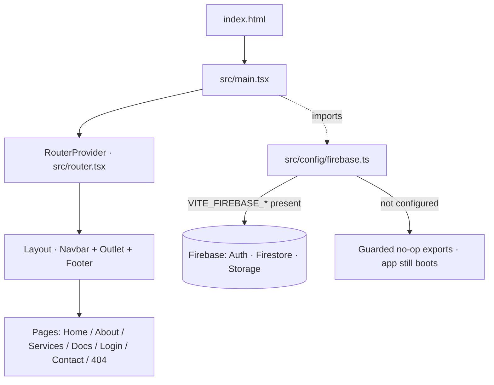

# Architecture & Stack

The stack is an opinionated, **vendor-neutral-where-possible** baseline. Versions
are **pinned baselines** — bump them deliberately, not accidentally.

## At a glance

| Layer | Default choice | Swap-friendly? |
| --- | --- | --- |
| Language | TypeScript (strict) | No — assumed everywhere |
| UI runtime | React 19 | Yes (Preact/Solid possible, not covered) |
| Build / dev server | Vite 8 | No — core of the template |
| Styling | Tailwind CSS 4 + Radix UI primitives | Yes |
| Auth / DB / Storage | Firebase (Auth, Firestore, Storage, RTDB) | Partial |
| Serverless backend | Firebase Cloud Functions (Node 22) | Yes (Cloud Run Node 24 noted) |
| Payments | Stripe (Checkout + Webhooks) | Yes (optional) |
| Hosting | Firebase Hosting | Yes (Cloud Run / static host noted) |
| Cloud platform | Google Cloud (`gcloud`) | No — Firebase lives on GCP |
| Errors / tracing | Sentry | Yes (optional) |
| Unit tests | Vitest + Testing Library | Yes |
| E2E tests | Playwright | Yes |
| Lint / format | ESLint 9 (flat config) | Yes |
| CI/CD | GitHub Actions | Yes |
| Agent tooling | Chrome DevTools MCP | Yes (optional) |

## Version baselines

### Language & framework

| Tool | Baseline | Why |
| --- | --- | --- |
| TypeScript | `~5.9` | Strict types across app, functions, scripts |
| React | `^19` | Component model; concurrent features |
| React Router | `^7` | Client routing + data APIs |

### Build & styling

| Tool | Baseline | Why |
| --- | --- | --- |
| Vite | `^8` | Dev server + Rolldown/Rollup-compatible production build |
| `@vitejs/plugin-react` | `^5` | JSX transform |
| Tailwind CSS | `^4` | Utility styling via `@tailwindcss/vite` |
| `lucide-react` | latest | Icon set |

### Backend / platform (playbook modules)

| Tool | Baseline | Why |
| --- | --- | --- |
| Firebase (web SDK) | `^12` | Auth, Firestore, Storage, RTDB, Analytics |
| `firebase-admin` | `^13` | Privileged server SDK in functions |
| Cloud Functions runtime | `nodejs22` | Serverless backend + webhooks + cron |
| Google Cloud (`gcloud`) | latest | Platform, IAM, billing, logs |

### Quality, testing, observability

| Tool | Baseline | Why |
| --- | --- | --- |
| Vitest + Testing Library | `^4` / latest | Unit + component tests |
| Playwright | `^1.6x` | E2E + visual/a11y audits |
| ESLint (flat config) | `^9` | Linting; `--max-warnings=0` in CI |
| Sentry (`@sentry/react`) | `^10` | Error + performance monitoring |
| `@firebase/rules-unit-testing` | `^5` | Firestore/Storage rules tests |

## How the runtime is wired

- **`src/config/firebase.ts`** only calls `initializeApp` when a project ID is
  present, so the template **builds and runs before credentials exist**. Exports
  (`auth`, `db`, `storage`) are `null` until configured.
- **`vite.config.ts`** sets the `@` → `src` path alias and splits `react` and
  `firebase` into separate chunks.
- **Tailwind 4** is loaded via the `@tailwindcss/vite` plugin (no separate
  `tailwind.config.js` required for the baseline).

## Required CLIs (full playbook)

| CLI | Install | Used in |
| --- | --- | --- |
| Node.js + npm (≥ 20; 22 recommended) | nvm / installer | all |
| Git | OS package | all |
| GitHub CLI (`gh`) | `brew install gh` | template + CI |
| Google Cloud CLI (`gcloud`) | Google installer | provisioning |
| Firebase CLI (`firebase-tools`) | pinned local `15.24.0` | provisioning + deploy |
| Stripe CLI (`stripe`) | `brew install stripe/stripe-cli/stripe` | billing (optional) |
| Chrome DevTools MCP | `npx chrome-devtools-mcp` | agent automation (optional) |

> 💡 You don't have to install these by hand —
> [`.SYSTEMX/scripts/bootstrap.sh`](https://github.com/WayneTechLab/SFWA-WTL-TEMPLATE/blob/main/.SYSTEMX/scripts/bootstrap.sh)
> installs, authenticates, and verifies all of them in one pass
> (`bash .SYSTEMX/scripts/bootstrap.sh --with-stripe --with-mcp --interactive-login`).

See the full rationale in
[`.SYSTEMX/Template/WEBAPP-STACK-G1.0.md`](https://github.com/WayneTechLab/SFWA-WTL-TEMPLATE/blob/main/.SYSTEMX/Template/WEBAPP-STACK-G1.0.md).
