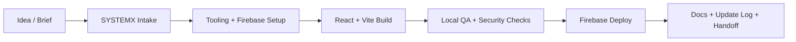
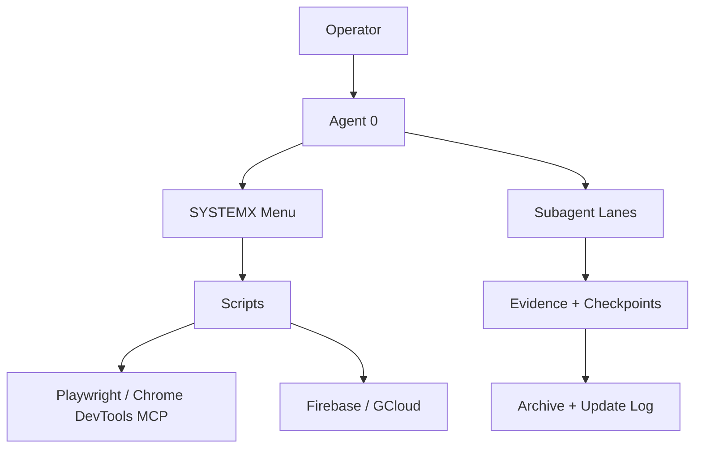

# S.F.W.A. Template Wiki

  

  

Welcome to the public **S.F.W.A. Template — ".SYSTEMX Forever WebApp"** wiki from
[Wayne Tech Lab LLC](https://WayneTechLab.com). This is the deep-dive home for a
repeatable Firebase web app standard built around React, TypeScript, Vite,
Firebase, local verification, Playwright, MCP/browser tooling, and SYSTEMX.

## Product Label

**S.F.W.A. Template** 
**".SYSTEMX Forever WebApp"** 
**A Product Provided by Wayne Tech Lab LLC.** 
**Version. Generation 1**

[Use The Template](https://github.com/WayneTechLab/SFWA-WTL-TEMPLATE/generate) |
[Repository](https://github.com/WayneTechLab/SFWA-WTL-TEMPLATE) |
[WayneTechLab.com](https://WayneTechLab.com) |
[Update Log](Update-Log)

## Start Here

| If you want to... | Go to |
| --- | --- |
| Get a running app in minutes | **[Quick Start](Quick-Start)** |
| Use `.SYSTEMX` from idea to production | **[User Ingest & Production Setup](User-Ingest-and-Production-Setup)** |
| Point an LLM at approved production assets | **[Production Kit](Production-Kit)** |
| Understand the stack | **[Architecture & Stack](Architecture-and-Stack)** |
| Learn the AI and browser tooling standard | **[Agent Mesh & Tooling Standard](Agent-Mesh-and-Tooling-Standard)** |
| Know where everything lives | **[Project Structure](Project-Structure)** |
| Configure Firebase and env files | **[Environment Variables](Environment-Variables)** |
| Ship safely | **[Security](Security)** |
| Deploy to Firebase | **[Deployment](Deployment)** |
| Test locally | **[Testing & QA](Testing-and-QA)** |
| Track template changes | **[Update Log](Update-Log)** |

## Idea To Production

## SYSTEMX Operating Model

## Who Benefits

| Beneficiary | Benefit |
| --- | --- |
| Solo builders | A working Firebase-ready base instead of a blank repo. |
| Small teams | One setup, one menu, one doc standard, one local verification path. |
| Agencies | A repeatable client-project base with clearer handoff. |
| AI-assisted developers | Agent 0 and subagents get bounded lanes and evidence rules. |
| Operators | Local scripts and menu flows before production deploys. |
| Security reviewers | Predictable places for env guidance, rules, warnings, and checks. |

## Ground Rules

This template is provided as-is. Fork, clone, and copy it at your own risk. You
are responsible for your own security review, credentials, service terms,
privacy obligations, accessibility, compliance, testing, and production support.

The public template stays generic. Project-specific vendors, customer workflows,
private dashboard steps, and proprietary connector logic belong in the project
created from the template.
