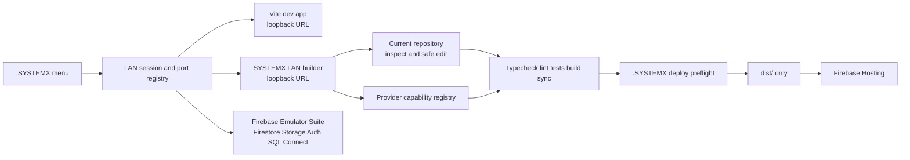

# SYSTEMX LAN Builder

The SYSTEMX LAN Builder is the local management surface for the SFWA-WTL-G1
template. It reuses the strongest general ideas from the public
[WTL-Instatic](https://github.com/WayneTechLab/WTL-Instatic) reference—visual
modules, reusable components, templates, collections, design tokens, media,
permissions, audit evidence, and publish separation—while keeping this
template's Firebase, Vite, Node, and `.SYSTEMX` operating rules.

## What it is for

The first target is the **current checkout**. A staff member or builder should
be able to open the local LAN dashboard, inspect the existing template, edit a
page or shared component, preview the result in Vite and Firebase emulators,
review a backup/diff, run quality gates, and decide whether to deploy.

It is not a new public route and it does not replace the normal React app. LAN
source stays under `.SYSTEMX/LAN`; the product's required Vite/Firebase files
stay at the repository root; production Hosting continues to publish `dist/`
only.

Local URLs:

```text
http://127.0.0.1:5173/             # public Vite app
http://127.0.0.1:5173/__systemx/   # LAN dashboard through Vite dev proxy
http://127.0.0.1:7331/             # LAN dashboard direct loopback service
```

The `/__systemx/` bridge is Vite development only. Firebase Hosting still
deploys the public `dist/` output and does not publish LAN files.

Current status: the functional G1 local-edit vertical slice is active. The
dashboard imports the current checkout's pages, routes, components, token
sources, KIT files, and provider capabilities. It can manage local page
metadata, typed node-tree fixtures, CMS/CRM records, local user fixtures, and
allowlisted React/Vite source files. Source writes are protected by a session
token, backup, secret scan, and explicit `SAVE LOCAL CHANGE` confirmation.
Cloud writes are not enabled by a readiness card; they require a future
authenticated adapter and the existing `.SYSTEMX` preflight.

## Webflow-class research overlay

The supplied `SFWA-WTL-WEBFLOW-RESEARCH-MASTER-PLAN-v1.0.0` package is now
preserved and mapped into `.SYSTEMX/LAN/Research/Webflow/`. It contributes a
clean-room study of 200 public/documented sources, a 13-wave implementation
roadmap, 91 feature rows, 106 backlog tasks, 27 risks, 91 acceptance criteria,
and draft contracts for the future Designer kernel.

This does not change the current capability claim. The G1 LAN vertical slice
is implemented and testable today; the full Webflow-class Designer begins at
Wave 0 and is not complete until every wave gate passes. See the dedicated
[SYSTEMX LAN Webflow Master Plan](SYSTEMX-LAN-Webflow-Master-Plan), the
[implementation overlay](https://github.com/WayneTechLab/SFWA-WTL-TEMPLATE/blob/main/.SYSTEMX/LAN/WEBFLOW-DEEP-RESEARCH-MASTER-PLAN.md),
and the [current status board](https://github.com/WayneTechLab/SFWA-WTL-TEMPLATE/blob/main/.SYSTEMX/status/WEBFLOW-LAN-MASTERPLAN.md).

The integrated Wave 0 checks are complete and remain available with `npm test`.
They start a
separate test LAN port, verify local health/read models, require the session
token for mutations, reject source paths outside the allowlist, and verify
runtime folders and arbitrary API commands are not exposed. The test server
uses an explicit test-only mode and does not overwrite the operator's active
session record.

The machine-readable
[`capability-manifest.json`](https://github.com/WayneTechLab/SFWA-WTL-TEMPLATE/blob/main/.SYSTEMX/LAN/Builder/contracts/capability-manifest.json)
separates supported, guarded, and planned behavior. It is intentionally more
conservative than the visual surface: a button or panel does not make a future
Designer capability supported.

## Current designer layout

The LAN builder uses a canvas-first, four-sided editor layout:

- top toolbar for Design, CMS, Insights, SYSTEMX, command search, and session
  status;
- left rail and left dock for structure tools such as Add, Pages, Navigator,
  Components, Assets, CMS, Cloud, and Audit;
- center canvas for the running Vite preview;
- resizable left and right panel dividers with keyboard support;
- right tool rail grouped as Design, Data, Build, and Ops;
- tabbed right inspector for Style/Settings, CMS/Users, Code/Cloud, and
  Agent 0/MCP/Gates;
- right inspector closed by default in `#canvas`;
- `Layers` canvas dock for layer tree and page-model tools, closed by default;
- fixed bottom application bar with centered responsive-device controls,
  Inspect/Interact mode, stack-location feedback, and an on-demand Evidence
  drawer.

Clicking Style or another right tool opens only that inspector. Clicking
canvas chrome outside the preview returns the workspace to `#canvas` and
collapses the right inspector; clicking an element inside the live preview
retains or opens its Settings context. Opening the right inspector closes the
bottom layer dock so the operator does not fight multiple side menus at once.
Panel widths and active tabs persist locally. At smaller desktop widths,
opening one heavy panel closes the other side to protect the canvas. At phone
widths, the selected panel replaces the canvas until the operator returns; it
never overlays the editor plane.

## Select the running app like an editor

Open LAN through the Vite bridge and leave **Inspect** enabled:

1. Hover any rendered item to see its boundary.
2. Click it to select it. The workspace reports its app route, mapped source
   file, and DOM path.
3. Right-click it to select a parent, open the Navigator, open mapped source,
   or stage the element as a module/component.
4. Use the Up Arrow to walk to the parent element.
5. Review the staged module in Components and type `SAVE MODULE` only when its
   name, source, tags, slots, and width contract are correct.
6. Turn Inspect off when testing links, forms, menus, or other normal app
   interactions.

For a heading, paragraph, label, or other safe leaf-text element, the click
also opens **Settings → Selected text**:

1. Edit the field and choose **Preview text** for an iframe-only change.
2. Choose **Revert preview** to restore the captured text without touching
   source.
3. Choose **Open source** to inspect the mapped React/TypeScript file.
4. Type `SAVE TEXT CHANGE` and choose **Save text to source** only after review.
5. SYSTEMX saves only when the original text appears exactly once in the
   allowlisted source. The normal secret scan, backup, atomic write, Vite hot
   reload, and quality-next handoff remain mandatory.

The Navigator hierarchy and Components selected-target card update from the
same preview selection. Nested elements, ambiguous source matches, and
unmapped content are intentionally routed to the source editor rather than
being rewritten automatically.

Header, footer, page-snap menu, help desk, and accessibility controls expose
`data-systemx-source` hints. Page sections map through the current route
registry. Inspection is intentionally unavailable from the direct LAN origin;
use `http://127.0.0.1:<vite-port>/__systemx/#canvas` so the preview and editor
share an origin. These hints exist only in Vite development, and the build
fails if any hint or LAN marker enters production `dist`.

The layout contract and 56-source official research register are maintained in:

- [SYSTEMX LAN Designer Contract](https://github.com/WayneTechLab/SFWA-WTL-TEMPLATE/blob/main/.SYSTEMX/LAN/WEBFLOW-STYLE-DESIGNER.md)
- [Web Builder UX Research](https://github.com/WayneTechLab/SFWA-WTL-TEMPLATE/blob/main/.SYSTEMX/LAN/WEB-BUILDER-UX-RESEARCH.md)

## Local topology



The start-of-day command discovers safe unused ports and records the owning
processes. The end-of-day command closes only those recorded processes and
verifies that the ports are free. It must never stop an unrelated local
project just because that project uses a familiar development port.

Port selection checks both `127.0.0.1` and `::1`, so a project listening on
either loopback family reserves that port. The active session is recorded in
ignored `.SYSTEMX/state/local-session.json`; stale PID files are removed only
when their process no longer exists. Use:

```text
npm run dev:systemx
npm run systemx:session:status
npm run systemx:session:stop
```

## Storage choices

The builder intentionally keeps storage products separate:

| Need | Service | Rule |
| --- | --- | --- |
| Draft pages, tokens, builder metadata | Firestore | Document-oriented data and live draft state |
| Optional presence or transient coordination | Realtime Database | Ephemeral state, not the audit record |
| CRM, reporting, relational transactions | Firebase SQL Connect + Cloud SQL for PostgreSQL | Explicit relational module with typed GraphQL operations |
| Web images, video, and uploads | Cloud Storage for Firebase | Firebase Rules and signed URL policy |
| Staff documents, setup packets, brand kits | Google Drive/Shared Drive | Operator document workflow, not public runtime data |
| Internal archives | Google Cloud Storage | Approved server/CLI archive path |

Firebase SQL Connect is the Firebase SQL-backed option. It connects to
PostgreSQL in Cloud SQL and uses schema/query/mutation definitions with a local
emulator path. Firestore and Realtime Database remain separate non-relational
Firebase products.

Useful references:

- [Firebase SQL Connect quickstart](https://firebase.google.com/docs/sql-connect/quickstart)
- [SQL Connect configuration reference](https://firebase.google.com/docs/sql-connect/configuration-reference)
- [Cloud Storage for Firebase](https://firebase.google.com/docs/storage)
- [Google Drive files and folders](https://developers.google.com/workspace/drive/api/guides/about-files)

## Builder objects

The visual editor is backed by typed data, not raw HTML pasted into a page:

- pages and layouts use a `NodeTree` of containers, text, images, links,
  buttons, lists, forms, slots, and outlets;
- reusable components have typed parameters and named slots;
- collections have a schema, provider, query contract, and access policy;
- loops bind a page module to an approved collection query;
- design tokens control color, type, spacing, responsive breakpoints, and
  sanitized CSS values;
- the centered bottom application bar provides desktop/laptop, Apple
  iOS/iPadOS, Android, exact-width, and Fit preview modes that resize the real
  local iframe;
- assets track provider, usage, content type, size, and sync state;
- every mutation has a backup, diff, validation result, and audit event.

The builder is allowed to provide detailed CSS controls, but values still pass
the template's sanitization and production-build checks. “Full CSS control”
does not mean arbitrary script or unsafe HTML injection.

## Logs and evidence

The LAN builder records local evidence without making it public:

- `.SYSTEMX/LAN/Temp/operations.jsonl` for local operation events;
- `.SYSTEMX/LAN/Backup/<timestamp>/` for pre-write snapshots;
- `.SYSTEMX/LAN/Files/component-registry.json` for reusable component records;
- `.SYSTEMX/LAN/Files/local-data.json` for local page, CMS/CRM, and user
  fixtures;
- `.SYSTEMX/LAN/Temp/ingest/<run-id>/manifest.json` for inventory-only
  existing-project scans.

Read the public log map in [SYSTEMX Logs and Evidence](SYSTEMX-Logs-and-Evidence).

## Staff workflow

1. Start the local SYSTEMX session from the menu.
2. Confirm the displayed Vite, LAN, and emulator URLs and active Firebase
   project mode.
3. Open the current-template workspace.
4. Inspect the route/page/component/token or data surface.
5. Make one bounded change.
6. Review the generated diff and backup record.
7. Confirm the write.
8. Preview in Vite and run the relevant emulator flow.
9. Run quality, security, structure, and sync checks.
10. Stop, hand off, or use the existing deploy preflight. Production deploy is
    never an implicit result of a local builder save.

## Implementation waves

The detailed plan and acceptance gates live in the main repository at
[`.SYSTEMX/LAN/BUILDER-SYSTEM-PLAN.md`](https://github.com/WayneTechLab/SFWA-WTL-TEMPLATE/blob/main/.SYSTEMX/LAN/BUILDER-SYSTEM-PLAN.md).
The short sequence is:

1. contracts and current-repository inventory;
2. loopback LAN shell and safe session ports;
3. current-template workspace and Vite/emulator health;
4. guarded backed-up page/node/source edits;
5. Firestore/Storage/Auth emulator workflows;
6. optional SQL Connect/Cloud SQL module;
7. scoped Drive/GCloud document and asset sync;
8. staff roles, audit timeline, publish preflight, and rollback evidence.

The builder remains subordinate to the `.SYSTEMX` CLI. Its API must be an
allowlisted action registry, never a generic shell, database, or cloud proxy.

The current-template workspace contract is available through the local-only
`/api/builder/workspace` endpoint and is backed by
`.SYSTEMX/LAN/Builder/contracts/builder-workspace.schema.json`. The local
editor uses `/api/builder/data`, `/api/builder/source`, `/api/builder/page`,
and `/api/builder/record`; mutating requests require the session header. The
provider selection is capability-based: Firestore and Realtime Database are
document or presence lanes; Firebase SQL Connect/Cloud SQL PostgreSQL is the
relational lane; Cloud Storage for Firebase is the web-media lane; Drive and
Google Cloud Storage are operator-document/archive lanes.

## What “full builder” means in G1

This is a management surface for the existing app, not a replacement website
generator. The operator can select a route, review the source file, change its
metadata, stage typed modules such as containers/text/forms/lists, create local
CMS/CRM records, add local role fixtures, load an allowlisted source file, and
save only after a backup and explicit confirmation. Vite then provides the
live preview. This makes the current template editable now while preserving a
clear adapter boundary for the future source-to-node round trip.

The provider cards show the storage/data plan and local tool availability. They
are not production connections. Firestore/Storage/Auth emulator workflows,
Firebase SQL Connect/Cloud SQL schema operations, Drive/GCS file sync, and
Stripe test/webhook operations are separate implementation waves with their
own credentials, scopes, evidence, and rollback rules.
