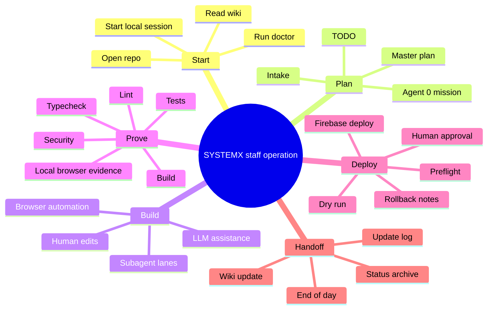
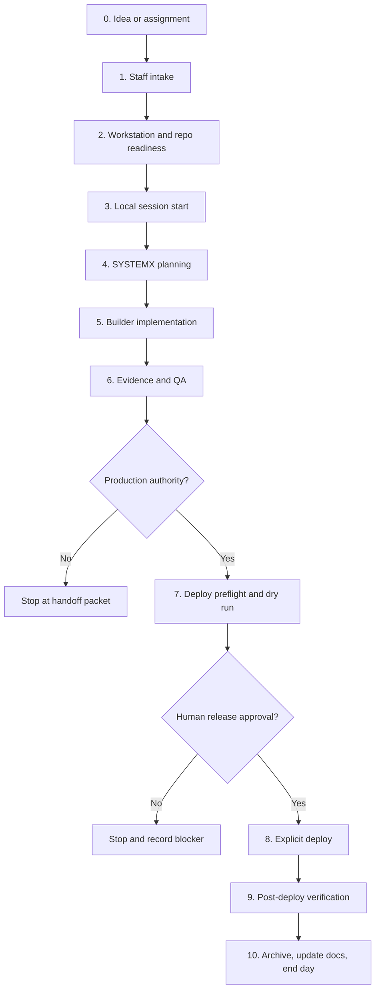
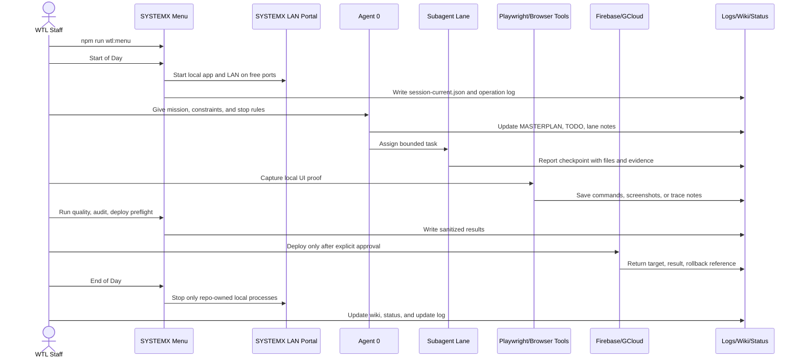
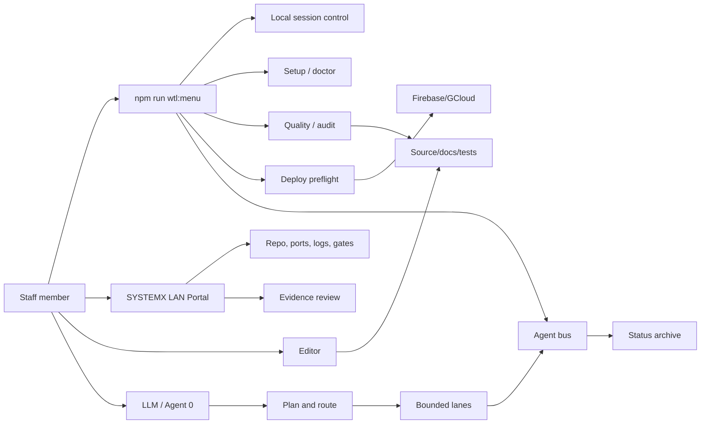

# SYSTEMX Staff Runbook and Builder Use Cases

This page is the hands-on operating runbook for S.F.W.A. Template staff,
builders, and AI-assisted operators. It answers four practical questions:

- Which screen, tool, or command do I use?
- In what order do I use it?
- What changes state?
- What evidence gets created, and when should I stop?

Use this with the [SYSTEMX 0 to Production Guide](SYSTEMX-0-to-Production-Guide),
[SYSTEMX Menu Operations](SYSTEMX-Menu-Operations), [SYSTEMX WEBPORTAL](SYSTEMX-WEBPORTAL),
and [LLM Interface and Tool Routing](SYSTEMX-LLM-Interface-and-Tool-Routing).

## Staff operating rule

A staff member does not treat the menu, portal, LLM, browser automation, or
cloud CLI as separate worlds. SYSTEMX is the control plane:

- The human owns intent, authorization, billing, production, and acceptance.
- Agent 0 owns planning, routing, checkpoint discipline, and handoff.
- Subagents own bounded lanes with no implicit deploy or secret authority.
- The menu runs repeatable commands.
- The LAN portal shows local state and evidence.
- Playwright and browser tools prove UI behavior.
- Firebase and Google Cloud CLIs change provider state only after explicit
  approval.
- Wiki, README, `.SYSTEMX/status`, and setup packets preserve the durable
  record.

If the next operator cannot reproduce what happened from repo files and
sanitized evidence, the work is not finished.

## Operating mind map



## Lifecycle tree



## Staff sequence flow



## Screen and tool map

| Work moment | Use this screen or tool | What changes state | Evidence created | Stop when |
| --- | --- | --- | --- | --- |
| First repo open | Git terminal, README, Wiki Home | Nothing required | Notes, `git status -sb` | Repo is wrong, dirty in unknown way, or branch is unexpected |
| Tooling readiness | `npm run wtl:doctor -- --strict=false` | No source state | Doctor output, platform detection | Node/tooling mismatch blocks build or cloud commands |
| Staff menu entry | `npm run wtl:menu` | Only selected commands change state | Menu log entry | Menu points to unexpected repo or platform |
| Start of day | `npm run wtl:local -- start-day` | `.SYSTEMX/LAN/session-current.json`, local processes | Local URL, ports, owned PIDs | Port is owned by another repo or the app fails to open |
| Firebase emulator work | `npm run wtl:local -- start-day --firebase` | Local emulator processes and ignored temp config | Emulator ports and demo project ID | A real Firebase project would be touched |
| Planning | `.SYSTEMX/status`, intake files, Agent 0 prompt | Plan and TODO files | MASTERPLAN, TODO, assumptions, blockers | Acceptance criteria or authority is unclear |
| Builder work | Editor, CLI, LLM, SDK, MCP tools | Source files, docs, tests | Diff, checkpoints, local results | Scope expands beyond the assigned mission |
| Browser proof | Playwright codegen, Chrome DevTools MCP | Usually no source state unless tests are added | Steps, screenshots, traces, reproduction notes | Login, popup, permission, or provider flow is unsafe |
| Quality gate | `npm run wtl:quality -- --build`, `npm run ci:all` | Build artifacts only | Lint, typecheck, test, build output | Any required gate fails |
| Security gate | `npm run wtl:audit`, security docs | Logs, accepted-risk records if needed | Audit result, rule review notes | High/critical finding is unowned or unaccepted |
| Deploy preflight | `npm run wtl:deploy -- --preflight` | No production state | Preflight report | Account, branch, target, or project is not exact |
| Deploy dry run | `npm run wtl:deploy -- --target hosting --dry-run` | No production state | Dry-run output | Dry run differs from expected target |
| Production deploy | Explicit deploy command | Firebase Hosting/rules/functions as selected | Deploy output, release notes, rollback reference | Human release authority is missing |
| End of day | `npm run wtl:local -- end-day` | Stops only repo-owned local processes | End-of-day status | Any owned process cannot be stopped cleanly |
| Handoff | Wiki, README, `.SYSTEMX/status`, update log | Documentation and status | Updated docs, archive summary | Next operator cannot reproduce the work |

## Staff case use: start to finish

1. Open the repo and confirm it is the public template or the intended child
   project.
2. Read the Wiki Home, Quick Start, Staff Runbook, 0 to Production Guide, and
   current Update Log.
3. Run `git status -sb` and stop if unknown local work could be overwritten.
4. Run `npm install` or `npm ci` according to the repo state.
5. Run `npm run wtl:doctor -- --strict=false`.
6. Start local work with `npm run wtl:local -- start-day`.
7. Open the local app and SYSTEMX LAN URL printed by the command.
8. Fill or review the intake files under `.SYSTEMX/Unified-Setup-Process/intake/`.
9. Update `.SYSTEMX/status/MASTERPLAN.md`, `.SYSTEMX/status/TODO.md`, and active
   lane notes.
10. Ask Agent 0 to route the mission and assign subagent lanes only after the
    target, files, and stop rules are clear.
11. Run implementation work through the editor, CLI, SDK, or MCP/browser tool
    that matches the task.
12. Capture browser proof with Playwright codegen or Chrome DevTools MCP when UI
    behavior, popups, auth, or provider dashboards matter.
13. Run local gates: `npm run typecheck`, `npm run ci:lint`, `npm run test`,
    `npm run build`, and the relevant SYSTEMX checks.
14. Run deploy preflight and dry run only after local proof is green.
15. Deploy only when the human operator confirms the Firebase project, account,
    target, cost, rollback path, and release authority.
16. Archive lane summaries, update the Wiki or README when the standard changed,
    and run `npm run wtl:local -- end-day`.

## Builder case use: using the template for a new project

A builder who starts from this public template should use a smaller version of
the staff process:

1. Generate a new repository from the template.
2. Clone it locally and run the one-line install for the current OS.
3. Run `npm run wtl:setup -- --check`.
4. Start local development with `npm run wtl:local -- start-day`.
5. Complete the intake files before wiring paid services or production data.
6. Build the smallest working Firebase-backed feature.
7. Use emulator mode for Auth, Firestore, Storage, and Hosting experiments.
8. Keep secrets out of source, prompts, setup packets, screenshots, and logs.
9. Run quality and security checks before each handoff.
10. Stop at dry run until the owner confirms production readiness.

The builder can use an LLM, but the LLM should be pointed at the standard files
first: README, AGENTS.md, `.SYSTEMX/README.md`, the active intake files,
`.SYSTEMX/status`, and this wiki page. The model should report assumptions,
files touched, commands run, evidence, blockers, and next action.

## Portal and command map



## State and evidence ledger

| State location | Purpose | Commit? | Secret safe? |
| --- | --- | --- | --- |
| `.SYSTEMX/status/MASTERPLAN.md` | Current mission and milestones | Yes, when generic or project-owned | No secrets |
| `.SYSTEMX/status/TODO.md` | Active task board | Yes, when useful | No secrets |
| `.SYSTEMX/status/AGENTS.md` | Agent lanes and handoff state | Yes | No secrets |
| `.SYSTEMX/state/local.json` | Local-only machine state | No | No secrets |
| `.SYSTEMX/LAN/session-current.json` | Owned local ports and PIDs | No | No secrets |
| `.SYSTEMX/logs/` | Sanitized operational logs | Usually no | No secrets |
| `.SYSTEMX/LAN/Temp/` | Ignored runtime files | No | No secrets |
| `.SYSTEMX/LAN/Backup/` | Local pre-write backups | No | May contain local copies, do not publish |
| `.SYSTEMX/Unified-Setup-Process/intake/` | Project plan and operating inputs | Yes, if sanitized | No secrets |
| Wiki pages | Public standard and operator guide | Yes, via wiki repo | Public only |
| Git tags/releases | Public release history | Yes | Public only |

## Stop rules

Stop the active task and record a blocker when any of these are true:

- The operator cannot identify the repo, branch, Firebase project, or account.
- A command would touch production but the human has not approved it.
- A local port belongs to another project and SYSTEMX cannot choose a free one.
- A tool asks for credentials in a place that would be logged or copied.
- A subagent needs broader access than the assigned lane.
- Quality, build, security, or deploy preflight fails.
- Browser automation reaches a popup, payment, permission, account, or provider
  screen that needs human judgment.
- Documentation would become misleading because the implementation changed but
  the README, Wiki, or `.SYSTEMX` source was not updated.

## Staff prompt

Use this prompt when handing the repo to an LLM as Agent 0:

```text
Act as Agent 0 for S.F.W.A. Template / SYSTEMX. Read README.md, AGENTS.md,
.SYSTEMX/README.md, .SYSTEMX/status/MASTERPLAN.md, .SYSTEMX/status/TODO.md,
the Wiki Staff Runbook, SYSTEMX 0 to Production Guide, and the relevant
implementation files before editing.

Route work through bounded lanes. For every task, report: objective, files
touched, commands run, evidence produced, state changed, blockers, next action,
and stop rule status. Do not request or expose secrets. Do not deploy or spend
money without explicit human approval. Use SYSTEMX commands first, then CLI,
SDK, MCP, browser automation, or manual steps only when the task requires it.
```

## Completion definition

A staff run is complete when:

- The local app can be started and stopped through SYSTEMX without interfering
  with other local projects.
- Required setup, build, quality, security, and preflight evidence exists.
- Changed behavior is reflected in README, Wiki, `.SYSTEMX` docs, or status
  files as appropriate.
- Agent 0 and subagent lane state is archived or handed off.
- The next operator has a clear start point and no hidden chat-only context.

