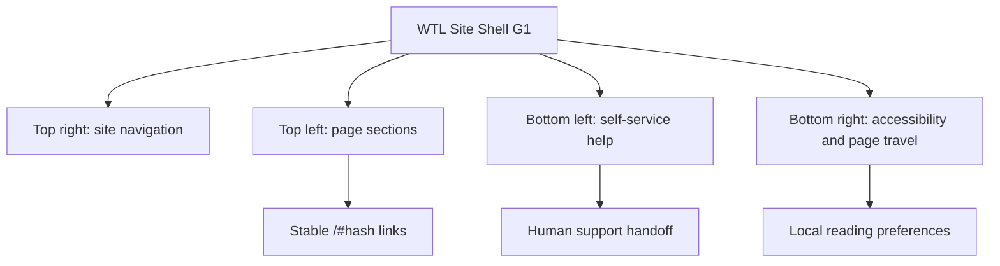

# WTL Site Shell G1

WTL Site Shell G1 is the reusable navigation and accessibility layer for a
generated S.F.W.A. Template project. It makes the primary site controls appear
in the same predictable place across Wayne Tech Lab LLC web properties while
leaving each project free to set its own content and brand tokens.

## The four controls

| Position | Control | Purpose |
| --- | --- | --- |
| Top right | Site navigation | A hamburger button opens the global route drawer. It is always visible. |
| Top left | Page snap menu | A section-aware table of contents jumps to stable `/#section-id` locations. It appears when a page has at least two meaningful sections. |
| Bottom left | Help desk | A safe self-service panel provides approved help content and a contact handoff. |
| Bottom right | Accessibility and page travel | Stores reading preferences, offers reduced motion and contrast options, and jumps to the page top or bottom. |



## How a project enables it

The configuration lives in
[`src/config/siteControls.ts`](https://github.com/WayneTechLab/SFWA-WTL-TEMPLATE/blob/main/src/config/siteControls.ts).

```ts
export const siteControls = {
  pageSnap: true,
  siteNavigation: true,
  accessibility: true,
  showPageTravel: true,
  helpDesk: 'help',
}
```

`helpDesk` accepts `off`, `help`, or `assistant`. The public template ships with
`help`: approved local content plus a contact handoff. `assistant` is a future
project-level integration point, not an instruction to expose provider keys or
private CMS content in the client.

## Page section contract

Use semantic sections and give each important section a clear label:

```tsx
<section id="services" data-snap-label="Services">
  <h2>Services</h2>
  {/* page content */}
</section>
```

The page-snap menu prefers `data-snap-label`, then a section heading. It creates
a stable ID only if a project author has not specified one. Public documentation
and campaign pages should prefer explicitly authored IDs so shared URLs survive
future copy changes.

## Accessibility behavior

- Every fixed trigger has a minimum 44 × 44 CSS-pixel touch target.
- Controls have visible focus states and accessible names.
- Escape closes menus and panels.
- Text size, line spacing, letter spacing, contrast, and motion choices are
  stored locally on the operator’s device.
- `prefers-reduced-motion` is respected even before the user chooses a custom
  motion setting.
- The top-left menu applies a scroll offset so a fixed header does not hide the
  destination heading.

## Support and admin boundary

The template help desk intentionally does not send visitor prompts to an AI
provider. When a project later adds a server-backed assistant, it must:

1. send calls through a protected backend or Firebase Function;
2. use only approved and published knowledge sources;
3. enforce authentication and Firebase rules for staff management;
4. never expose provider secrets, private CMS content, or admin actions in the
   browser;
5. apply rate limits, abuse controls, audit logging, and a human handoff path.

Level 4 staff may maintain approved support entries. Level 5 owners may publish
entries and manage project-level assistant configuration. Authorization must be
enforced server-side and in security rules; hiding a link is not authorization.

## Validation

Run the standard application checks, then inspect the live controls at desktop
and mobile widths:

```bash
npm run lint
npm run typecheck
npm run build
npm run dev
```

Check for corner-control collisions, keyboard navigation, visible focus,
section hash updates, saved preferences, and safe Help Desk content.
